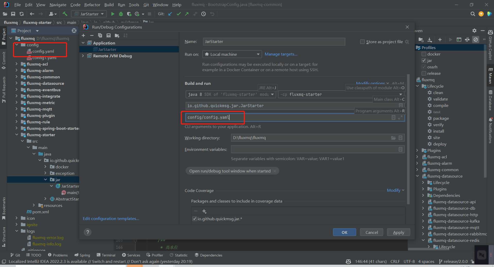

# 安装部署
## 源码下载
> 联系管理员 18510240791 购买企业级软件后，提供私有仓库代码访问权限

## 源码编译
获取源码后，直接跟根目录执行

```shell
mvn clean package -Dmaven.test.skip=true -Pjar 
```
启动的jar位于module :   fluxmq-starter目录下
## 配置文件
新建配置文件 config.yaml,具体文件参考  `配置指南`

###  启动脚本
```shell
#!/bin/sh
# author name：root

#	$0 是文件名
#	$1 是第一个参数

# echo $0 start 是启动服务
# echo $0 stop 是停止服务
# echo $0 restart 是重启服务
# echo $0 status 是查看服务状态

# 指定JAR包文件夹，将来运行的时候，此文件需要与jar包同级
AppName=fluxmq-bootstrap.jar
Console=console.log


# JVM参数
JVM_OPTS="  -Dname=$AppName  -Duser.timezone=Asia/Shanghai -XX:MetaspaceSize=200M  -XX:+UseG1GC   -Xmx12G -Xms12G -XX:MaxGCPauseMillis=200 -Xloggc:`$APP_HOME`/gc.log -XX:GCLogFileSize=10M -XX:NumberOfGCLogFiles=10 -XX:+UseGCLogFileRotation -XX:+PrintGCDateStamps -XX:+PrintGCTimeStamps -XX:+PrintGCDetails -XX:+DisableExplicitGC -verbose:gc "

# 此变量会获取到当前路径 等价于 Linux的pwd命令
APP_HOME=`pwd`
# 日志路径 一定要有此路经的文件夹，没有此路径的文件夹，将不会有日志文件：$AppName.log，记得创建logs文件夹。

# 获取第一个参数 如果为空，将会提示这个
if [ "$1" = "" ];
then
echo -e "\033[0;31m 未输入操作名 \033[0m  \033[0;34m {start|stop|restart|status} \033[0m"
exit 1
fi

# 如果没有指定JAR包，将会提示这个
if [ "$AppName" = "" ];
then
echo -e "\033[0;31m 未输入应用名 \033[0m"
exit 1
fi

# start方法
function start()
{
# 获取PID，最后打印出结果$2 就是PID 注意，此处$2不是我们运行此脚本的第二个参数($0 不算做第一个参数)！
PID=`ps -ef |grep java|grep $AppName|grep -v grep|awk '{print $2}'`

if [ x"$PID" != x"" ]; then
echo "$AppName is running..."
else
rm -rf $Console
touch $Console
nohup java -jar  $JVM_OPTS $AppName config.yaml   >$Console  2>&1 &

# 下面可以查看一下命令对不对
#echo	"nohup java -jar  $JVM_OPTS $AppName  2>&1 & > console.log"
echo "Start $AppName success..."
fi
}

# stop方法
function stop()
{
echo "Stop $AppName"

PID=""
# 定制查询服务PID的方法
query(){
PID=`ps -ef |grep java|grep $AppName|grep -v grep|awk '{print $2}'`
}
# 第一次查询状态，更变PID
query

if [ x"$PID" != x"" ]; then
kill -TERM $PID
echo "$AppName (pid:$PID) exiting..."
while [ x"$PID" != x"" ]
do
# 间隔1秒执行后续代码
sleep 1
# 这是一个死循环，检查每一次PID，都会更变PID的最新结果，如果PID等于空了，就结束循环，输出结束
query
done
echo "$AppName exited."
else
echo "$AppName already stopped."
fi
}

# restart方法 注意方法内部的内容：调用了2个别的方法，所以从脚本加载从上倒下的顺序上，这2个被调用的方法，都要在此方法之前！
function restart()
{
# 先停止服务，然后等待2秒后，再次重启服务，不过2秒时间太短，建议久一点
stop
sleep 2
start
}

# status方法
function status()
{
# 获取PID
PID=`ps -ef |grep java|grep $AppName|grep -v grep|wc -l`

# 如果PID为0，代表服务器停止，不为0，就代表服务器正在运行
if [ $PID != 0 ];then
echo "$AppName is running..."
else
echo "$AppName is not running..."
fi
}

# 获取第一个参数，执行不同的方法！
case $1 in
start)
# 执行start方法
start
;;
stop)
# 执行stop方法
stop
;;
restart)
# 执行resrart方法
restart
;;
status)
# 执行status方法
status
;;
*)
# case的结束标志
esac

```
##  启动项目
###  启动服务
>  ./fluxmq.sh start

###  重启服务
>  ./fluxmq.sh restart

###  关闭服务
>  ./fluxmq.sh stop

# IDEA启动
> fluxmq-starter module下的JarStarter类，启动时指定配置文件的相对路径即可


直接run或者debug启动即可

