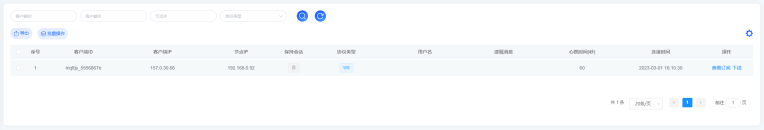
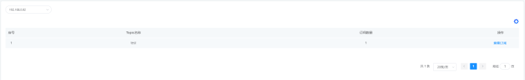
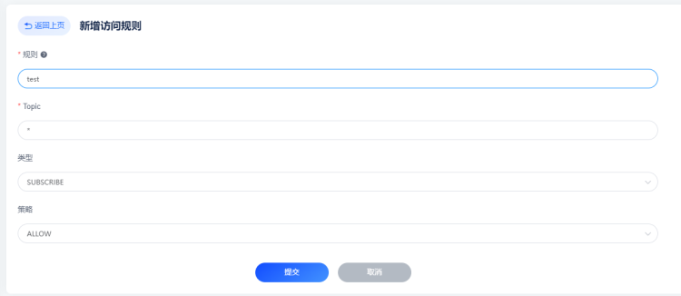

# 连接管理
连接管理是FluxMQ平台的基础功能模块，负责设备连接认证，连接管理，连接权限控制等；FluxMQ提供一个后台web控制台，用户可通过页面直接进行客户端的管理和控制。  
## 连接认证  
身份认证是大多数应用的重要组成部分，MQTT 协议支持用户名密码认证，启用身份认证能有效阻止非法客户端的连接。  
**密码认证（MQTT）**  
连接客户端需提供username和password，才能连接平台，否则平台会拒绝非法连接。  
**其他认证（传输层面）**  
除了账号密码外，平台还支持TLS证书的连接认证。这些身份凭据会提前存储到数据库中，密码通常都会以加盐后散列的形式存储；


## 连接管理

连接管理展示当前接入服务器和会话尚未过期的连接列表及客户端基本信息；对于非法客户端可手动进行下线处理。

默认状态下页面过滤条件字段只显示客户端 ID、客户端IP和节点IP等，如需展示所有，可点击表格右侧设置按钮，可选择展示所有可用于过滤的条件字段；可使用客户端 ID ，客户端IP，节点IP和协议类型进行模糊搜索以对连接列表进行过滤；

## 主题管理
主题列表展示不同节点订阅主题，如果在相同节点，不同连接订阅同一主题，列表将进行去重处理；
> 可通过主题详情查看同一主题，不同订阅客户端的情况


## 访问控制
访问控制是对发布订阅的ACL的权限控制，例如拒绝某个用户向某个主题发布消息；
主要规则说明：

1. 允许客户端ID为 `device`的客户端订阅 `$report/#`主题。
2. 允许IP地址为：`127.0.0.1 `的客户端发布/订阅`$report/#`与`$data/#`主题。
3. 禁止全部客户端订阅`$report/#`与`$data/#`主题。
4. 允许所有客户端发布订阅所有主题。
```
{allow，{clientid,"device"},subscribe,["$report/#"]}     #规则1
{allow，{ipaddr,"127.0.0.1"},subscribe,["$report/#"，"$data/#"]}    # 规则2
{deny，all,subscribe,["$report/#"，{eq,"&data/#"}]}       #规则3
{allow,all}       #规则4
```

具体页面操作：

**自动封禁**  
在主题管控的基础上，支持自动封禁那些被检测到短时间内频繁登录的客户端，并在一段时间拒绝这些客户端的登录，避免此类客户端过多占用服务器资源。

