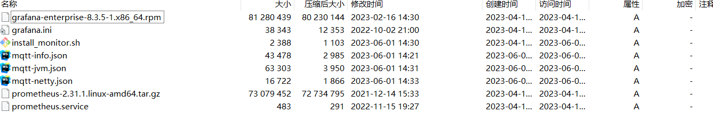
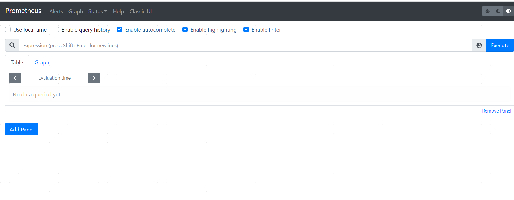
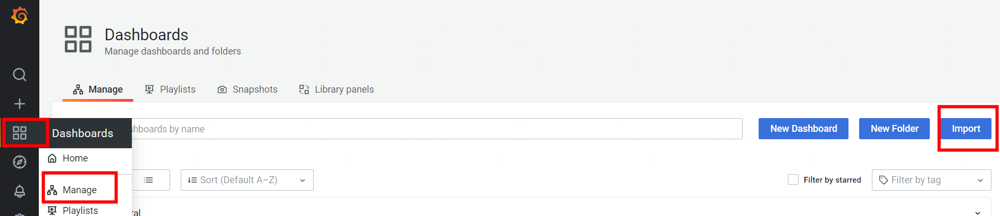
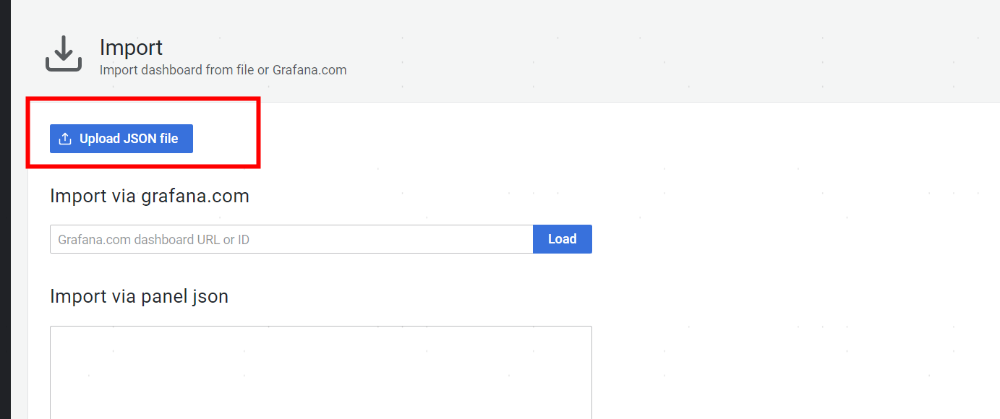
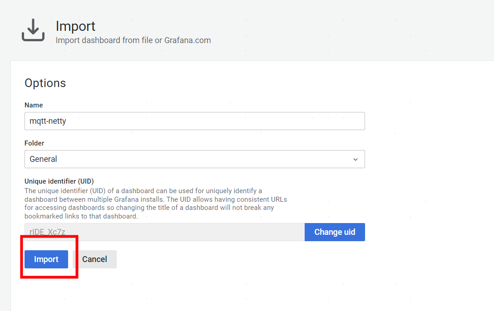

# 监控系统
## 1. 执行安装脚本
> 脚本联系管理员获取
上传安装包install_monitor.zip 到服务器上，解压后包含以下文件


```shell
> 
```shell
unzip install_monitor.zip
#进入解压目录
cd ~/install_monitor
#执行部署脚本 后面的ip端口修改成具体的网关节点ip端口，如果有多个请用逗号隔开
sh install_monitor.sh  192.168.1.12:60000,192.168.2.14:60000
```
## 2. 验证
prometheus ui界面 ：http://ip:9090

grafana ui界面：http://ip:3000/login


## 3. grafana 图表导入
浏览器打开http://ip:3000/login,输入用户名、密码(admin/admin)


## 4. 导入json
> 再解压后有三个json文件，分别是mqtt-info.json、mqtt-netty.json、mqtt-jvm.json



