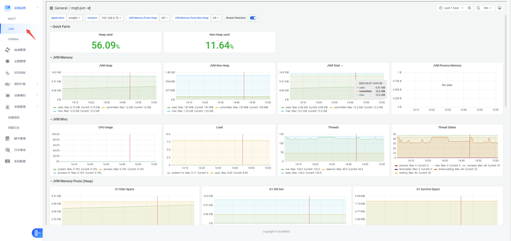

# 运维监测

平台运维监测主要采用集成第三方组件进行展示和通知（Granfna+Prometheus）；直观可视化的展示MQTT和JVM监测（java技术关键监测内容）；当服务器等出现异常时会及时通过用户，做出风险应对措施。

- 比起dashbaord展示更多监测指标和历史趋势，方便运维定位问题。

## MQTT监测
实时监测MQTT接入设备和数据量。

## JVM监测
JVM是连接和并发量的关键监测指标，可监测运行状态是否超负荷。

## 告警配置
FluxMQ内置监控与告警功能，目前支持监控 CPU 占用率、内存占用率、节点状态等并进行告警。所有告警都将产生一条警告日志并由平台发布到一个主题，方便用户进行订阅来获取告警通知。
告警通知信息的Payload的Json格式，包含以下字段：

| **字段** | **说明** |
| --- | --- |
| ID | 告警ID |
| name | 监控项 |
| message | 人类易读的告警说明 |
| alarm_time | 告警时间 |
| send | 是否已发送 |

具体业务操作界面如下所示：  
**用户自定义配置告警规则；**

**监控项**

| **序号** | **监控项** |
| --- | --- |
| 1 | 主机CPU告警 |
| 2 | 主机内存告警 |
| 3 | 集群节点状态告警 |
| 4 | 规则引擎故障告警 |
| 5 | 非法连接告警 |
| 6 | 集群状态告警 |

**通知渠道**

| **序号** | **通知渠道** |
| --- | --- |
| 1 | 飞书 |
| 2 | 钉钉 |
| 3 | 微信 |

## 告警日志
告警日志页面可分类查询系统所有历史告警记录，可通过告警ID和监控项进行筛选查看。

## 在线调试
FluxMQ提供了简洁的图形界面和操作逻辑，支持 MQTT/MQTT over Websocket 接入以及单/双向 SSL 认证，同时支持 Payload 格式转换、自定义脚本模拟测试数据、 $SYS 主题自动订阅查看流量统计等诸多实用功能。  
**配置连接和主题**  
平台支持ws接口进行在线连接和模拟测试；

**在线调试**

