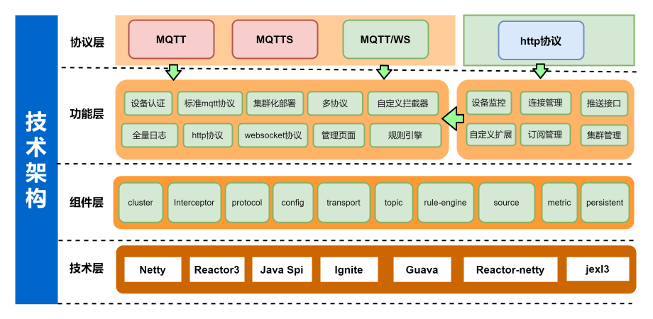

# 产品介绍
FLuxMQ是一款基于java开发，支持无限设备连接的云原生分布式物联网接入平台。  
FluxMQ基于Netty开发，底层采用Reactor3反应堆模型，具备低延迟，高吞吐量，百万-千万设备连接；方便企业快速构建其物联网平台与应用。
## 核心特性
**JAVA开发**  
可构建物联网一体化平台产品，单机版整体打包，避免多语言组件多模块管理；  
**支持标准MQTT协议**  
完整支持MQTT3.x和MQTT5.0 协议标准；  
支持Qos0，1，2的MQTT消息传递；  
支持所有MQTT客户端和库；  
**规则引擎**  
灵活的规则模型配置，支持多种数据桥接和数据持久化；  
**数据安全**  
基于MQTT overTLS/SSL确保数据安全；  
LDAP，PSK和X.509证书等多种身份认证；  
**灵活部署**  
支持物理机，容器，私有云，公有云中任何地方运行，不受位置限制，不受厂商锁定；  
**低成本**  
性能卓越，降低硬件需求成本；  
支持买断和按需付费;   
## 架构

## 功能概览
| 功能 | 说明 |
| --- | --- |
| 集群功能 | 支持MQTT集群 |
| 发布订阅 | 支持标准发布订阅 |
| 服务等级 | QoS0，1，2 |
| ACL | 控制客户端发布订阅权限 |
| 流量控制 | 限制Broker接入流量 |
| MQTT/MQTTS/WS协议 | 多协议支持 |
| 管理页面-连接管理 | 管理客户端状态，上下线 |
| 管理页面-ACL | 访问授权 |
| 管理页面-订阅查询 | 查看设备订阅Topic |
| 管理页面-规则引擎 | 转发消息 |
| 管理页面-云客户端 | 基于ws进行模拟测试 |
| 管理页面-动态认证 | 连接认证 |
| 管理页面-日志管理 | 标准接入日志 |
| 管理页面-监控管理 | grafana监控方案 |
| 管理页面-数据源管理 | 多数据源 |
| 管理页面-告警功能 | 支持钉钉、微信、飞书 |
| 管理页面-协议解析 | 支持脚本解析处理payload |

