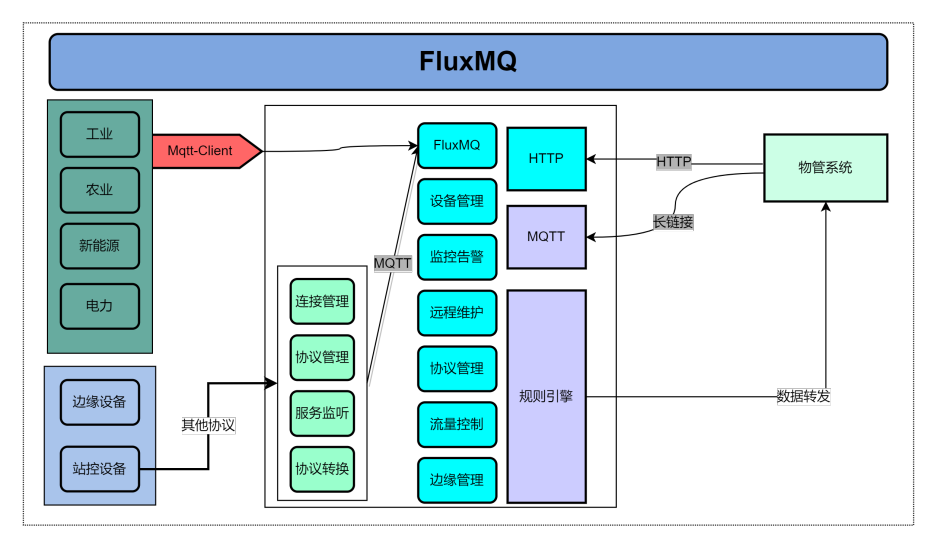

# 产品介绍
FLuxMQ是一款基于java开发，支持无限设备连接的云原生分布式物联网接入平台。  
FluxMQ基于Netty开发，底层采用Reactor3反应堆模型，具备低延迟，高吞吐量，百万-千万设备连接；方便企业快速构建其物联网平台与应用。

## 产品特点
**JAVA开发**  
可构建物联网一体化平台产品，单机版整体打包，避免多语言组件多模块管理；  
**支持标准MQTT协议**  
完整支持MQTT3.x和MQTT5.0 协议标准；  
支持Qos0，1，2的MQTT消息传递；  
支持所有MQTT客户端和库；  
**规则引擎**  
灵活的规则模型配置，支持多种数据桥接和数据持久化；  
**数据安全**  
基于MQTT overTLS/SSL确保数据安全；  
LDAP，PSK和X.509证书等多种身份认证；  
**灵活部署**  
支持物理机，容器，私有云，公有云中任何地方运行，不受位置限制，不受厂商锁定；  
**低成本**  
性能卓越，降低硬件需求成本；  
支持买断和按需付费; 

## 技术架构
