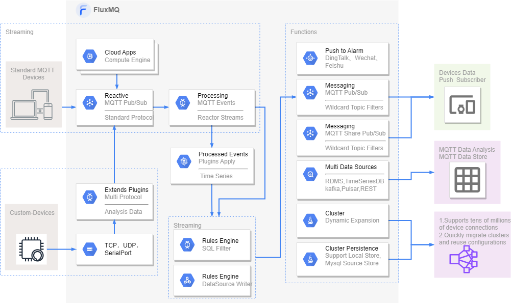

# 产品介绍
FLuxMQ是一款基于java开发，支持无限设备连接的云原生分布式物联网接入平台。  
FluxMQ基于Netty开发，底层采用Reactor3反应堆模型，具备低延迟，高吞吐量，千万-亿级别设备连接；方便企业快速构建其物联网平台与应用。

## 产品特点

| 特点   | 说明                                                       |
|------|----------------------------------------------------------|
| 高性能  | 单机支持百万连接、支持几十万TPS消息，性能领先99%同行产品                          | 
| 集群   | 集群化设计、支持节点动态伸缩                                           | 
| 规则引擎 | 支持SQL引擎，完成0代码数据过滤、转发。支持多种数据源转发、功能丰富                      | 
| 可配置化 | 平台99%的功能都是可以通过管理页面配置，完成傻瓜式集群操作，支持配置本地存储，无需依赖第三方          |
| 安全   | 支持多种安全认证，支持MQTT over TLS/SSL，支持LDAP、PSK、X.509证书等多种身份认证   |
| 低成本  | 性能卓越，降低硬件需求成本；支持买断和按需付费                                  |
| 多协议  | 全网唯一一款支持自定义协议扩展的产品，只需要一个接口即可完成自定义协议的集群化,收敛多协议，提供统一的数据出入。 |
| 运行版本 | 支持JDK8、JDK11、JDK17、GRAALVM等部署方式                          |

## 技术架构
