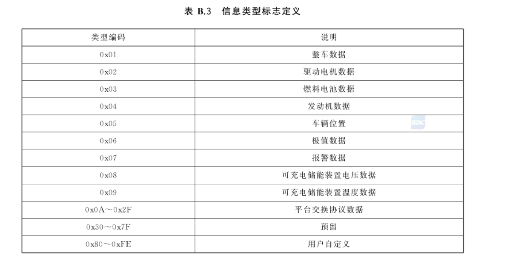
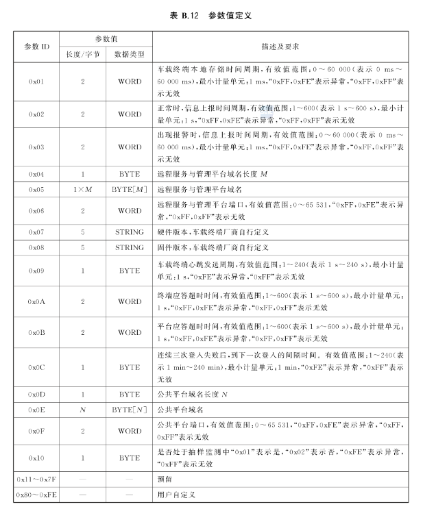

# GB/T32960 
> GBT32960是中国国家标准《电动汽车远程服务与管理规范》的代号。该标准于2016年发布，用于规定电动汽车的远程服务与管理规范，包括车辆远程诊断、数据采集、远程控制等方面的内容。这个标准有助于确保电动汽车在远程管理和服务方面的安全性、稳定性和互操作性

协议参考： [GB/T32960](http://c.gb688.cn/bzgk/gb/showGb?type=online&hcno=674DE45C0AD3DE2CD75B9C4CD8ED57C1)

## 启动服务
> GB/T32960协议插件启动同时支持3种认证方式,如果默认不加密报文则不需要传AES-128、RSA的密钥，具体加密方式由客户端决定。服务端解析协议拿到加密方式后，再动态解密报文

## 上行消息

### 结构体
```JSON
{
  "cmd": 3,
  "ack": 254,
  "vin": "LDYECS745J0005557",
  "data": {}
}
```

### 车辆登入
> 默认会走FluxMQ，clientId为vim，用户名密码为空。

```JSON
{
	"cmd": 1,
	"ack": 254,
	"vin": "LDYECS745J0005557",
	"data": {
		"loginTime": "2018-05-03 13:27:17",
		"serialNumber": 1,
		"iccId": "8986061602001964944S",
		"number": 1,
		"length": 0
	}
}
```

### 实时信息上报：
#### 数据类型:



```JSON
{
	"cmd": 2,
	"ack": 254,
	"vin": "LDYECS745J0005557",
	"data": {
		"loginTime": "2018-05-03 13:28:01",
		"items": [{
			"dataType": 1,
			"state": -1,
			"chargeState": -1,
			"runMode": 1,
			"speed": -1,
			"mileage": 4294967295,
			"voltage": -1,
			"current": -1,
			"soc": -1,
			"dcStatus": -1,
			"gear": 0,
			"insulationResistance": 0
		}, {
			"dataType": 5,
			"effective": true,
			"latitudeSite": 0,
			"longitudeSite": 0,
			"longitude": 116062282,
			"latitude": 36452787
		}, {
			"dataType": 6,
			"maxVoltageBatterySubSystemNumber": 255,
			"maxVoltageBatterySingleBatteryNumber": 255,
			"maxVoltageBatterySingleBatteryVoltage": -1,
			"minVoltageBatterySubSystemNumber": 255,
			"minVoltageBatterySingleBatteryNumber": 255,
			"minVoltageBatterySingleBatteryVoltage": -1,
			"maxTemperatureSubSystemNumber": 255,
			"maxTemperatureProbeNumber": 255,
			"maxTemperatureValue": -1,
			"minTemperatureSubSystemNumber": 255,
			"minTemperatureProbeNumber": 255,
			"minTemperatureValue": -1
		}, {
			"dataType": 7,
			"alarmLevel": 0,
			"commonFlag": 0
		}]
	}
}
```

### 补发信息上报
```JSON
{
	"cmd": 3,
	"ack": 254,
	"vin": "LDYECS745J0005557",
	"data": {
		"loginTime": "2018-05-03 18:08:17",
		"items": [{
			"dataType": 1,
			"state": 1,
			"chargeState": 3,
			"runMode": 1,
			"speed": 0,
			"mileage": 72150,
			"voltage": 6320,
			"current": 10010,
			"soc": 55,
			"dcStatus": 1,
			"gear": 0,
			"insulationResistance": 5373
		}, {
			"dataType": 2,
			"motors": [{
				"serialNumber": 1,
				"driveMotorState": 3,
				"driveMotorControllerTemperature": 70,
				"driveMotorSpeed": 20000,
				"driveMotorTorque": 20000,
				"driveMotorTemperature": 70,
				"motorControllerInputVoltage": 6320,
				"motorControllerCurrent": 10000
			}]
		}, {
			"dataType": 5,
			"effective": true,
			"latitudeSite": 0,
			"longitudeSite": 0,
			"longitude": 116062263,
			"latitude": 36452801
		}, {
			"dataType": 6,
			"maxVoltageBatterySubSystemNumber": 1,
			"maxVoltageBatterySingleBatteryNumber": 1,
			"maxVoltageBatterySingleBatteryVoltage": 3300,
			"minVoltageBatterySubSystemNumber": 1,
			"minVoltageBatterySingleBatteryNumber": 1,
			"minVoltageBatterySingleBatteryVoltage": 3300,
			"maxTemperatureSubSystemNumber": 1,
			"maxTemperatureProbeNumber": 2,
			"maxTemperatureValue": 67,
			"minTemperatureSubSystemNumber": 1,
			"minTemperatureProbeNumber": 1,
			"minTemperatureValue": 66
		}, {
			"dataType": 7,
			"alarmLevel": 0,
			"commonFlag": 0
		}, {
			"dataType": 8,
			"voltages": [{
				"serialNumber": 1,
				"voltage": 6320,
				"current": 0,
				"cellCount": 0,
				"cellNumber": 10010,
				"cellVoltage": "\u0000\u0001�\f�\f�\f�\f�\f�\f�\f�\f�\f�\f�\f�\f�\f�\f�\f�\f�\f�\f�\f�\f�\f�\f�\f�\f�\f�\f�\f�\f�\f�\f�\f�\f�\f�\f�\f�\f�\f�\f�\f�\f�\f�\f�\f�\f�\f�\f�\f�\f�\f�\f�\f�\f�\f�\f�\f�\f�\f�\f�\f�\f�\f�\f�\f�\f�\f�\f�\f�\f�\f�\f�\f�\f�\f�\f�\f�\f�\f�\f�\f�\f�\f�\f�\f�\f�\f�\f�\f�\f�\f�\f�\f�\f�\f�\f�\f"
			}]
		}, {
			"dataType": 9,
			"temperatures": [{
				"serialNumber": 1,
				"probeTemperature": "BCBCCCBCCCCCBCCCBCCCCCBB"
			}]
		}]
	}
}

```
### 车辆登出
> 此报文会关闭连接
```json
{
	"cmd": 4,
	"ack": 254,
	"vin": "LDYECS745J0005557",
	"data": {
		"loginTime": "2018-05-03 13:28:01",
		"serialNumber": 511
	}
}
```
## 下行
> 下行指令通过MQTT下发给具体的设备,TOPIC规则为：GBT32960/down/{vin}
###  参数表
> 参数设置、参数查询请参考此表


### 参数设置
```json
{
	"cmd": 129,
	"ack": 254,
	"vin": "LDYECS745J0005557",
	"encrypt": 1,
	"time": "2022-12-14 12:21:21",
	"params": {
      "1": 123,
      "2": 13
    }、；。/
}
```
    

### 参数读

> ids传参数ID集合
```json
{
	"cmd": 128,
	"ack": 254,
	"vin": "LDYECS745J0005557",
	"encrypt": 1,
	"time": "2022-12-14 12:21:21",
	"ids": [1, 2]
}
```

### 控制指令
```json
{；。
	"cmd": 130,
	"ack": 254,
	"vin": "LDYECS745J0005557",
	"encrypt": 1,
	"time": "2022-12-14 12:21:21",
	"ids": [1, 2]
}
```；、A