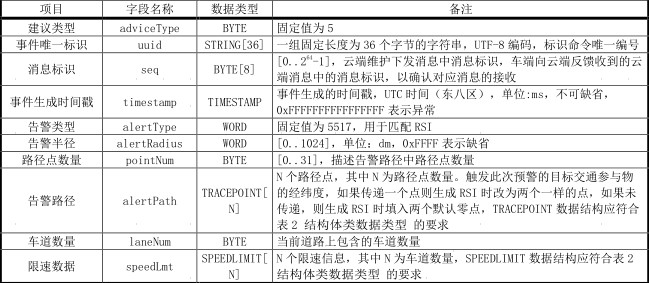

# V2C
> V2C基于《智能网联汽车云控系统》的第2部分。这个标准适用于智能网联汽车云控系统中智能网联汽车车载终端与云控基础平台的数据交互

## 启动服务
> V2C协议插件启动支持6种认证方式,如果默认不加密报文则不需要传AES-128、RSA、SM2、SM4的密钥，具体加密方式由客户端决定。服务端解析协议拿到加密方式后，再动态解密报文
> 
> 
## 上行消息
### 结构体
```JSON
{
  "type": 0x15,
  "version": 1,
  "data": {}
}
```

### 车辆注册

```JSON
{
     "type": 0x62,
     "version": 1,
     "data": {
		"vehicleBrand": "qm123456",
		"vehicleType": 1,
		"fuelType": 1,
		"adLevel": 1,
		"conLevel": 1,
		"plateNumber": "苏A123456",
		"terminalType": "123456",
		"userdefinedData": null
	}
}
```
### 车辆准静态参数信息

```JSON
{
     "type": 0x34,
     "version": 1,
     "data": { 
        "vehicleId": "123456789", 
        "swVersion": "1.0.0",
        "hwVersion": "2.0.0", 
        "adVersion": "3.0.0", 
        "comType": 1, 
        "posConfidence": 90, 
        "timeSync": 1, 
        "gnssType": 2, 
        "userdefinedData": "Test Data" }
}
```
### 车辆运行状态信息
#### 车辆基础信息

#### 车辆辅助驾驶系统信息


#### 自动驾驶系统信息

```JSON
{
     "type": 0x15,
     "version": 1,
     "data": [{
	    "vehicleId": "123456789",
	    "messageId": 12345,
	    "timestampGNSS": 1629372000000,
	    "velocityGNSS": 80,
	    "position": {
	    	"latitude": 37.123456,
	    	"longitude": -122.987654,
	    	"elevation": 100
	    },
	    "heading": 90,
	    "tapPos": 2,
	    "steeringAngle": 45,
	    "velocityCAN": 60,
	    "accelerationLon": 5,
	    "accelerationLat": 2,
	    "accelerationVer": 1,
	    "yawRate": 30,
	    "accelPos": 70,
	    "engineSpeed": 3000,
	    "engineTorque": 250,
	    "brakeFlag": 1,
	    "brakePos": 50,
	    "brakePressure": 100,
	    "fuelConsumtion": 20,
	    "driveMode": 1,
	    "destLocation": {
	    	"latitude": 37.987654,
	    	"longitude": -122.123456
	    }
}]
```
```JSON
{
     "type": 0x15,
     "version": 2,
     "data": [{
	    "vehicleId": "123456789",
	    "messageId": 12345,
	    "timestampGNSS": 1629372000000,
	    "velocityGNSS": 80,
	    "position": {
	    	"latitude": 37.123456,
	    	"longitude": -122.987654,
	    	"elevation": 100
	    },
	    "heading": 90,
	    "tapPos": 2,
	    "steeringAngle": 45,
	    "velocityCAN": 60,
	    "accelerationLon": 5,
	    "accelerationLat": 2,
	    "accelerationVer": 1,
	    "yawRate": 30,
	    "accelPos": 70,
	    "engineSpeed": 3000,
	    "engineTorque": 250,
	    "brakeFlag": 1,
	    "brakePos": 50,
	    "brakePressure": 100,
	    "fuelConsumtion": 20,
	    "driveMode": 1,
	    "destLocation": {
	    	"latitude": 37.987654,
	    	"longitude": -122.123456
	    }
           },{
	    "absFlag": 1,
	    "tcsFlag": 0,
	    "espFlag": 1,
	    "lkaFlag": 0,
	    "accMode": 2,
	    "fcwFlag": 1,
	    "ldwFlag": 0,
	    "aebFlag": 1,
	    "lcaFlag": 0,
	    "dmsFlag": 1,
	    "mileage": 50000,
	    "fuelGauge": 75,
	    "soc": 50,
	    "temperature": 25,
	    "endurance": 200,
	    "vehFault": 3,
	    "motorspeed": 3000,
	    "motortorque": 250,
	    "vehMode": 2,
	    "chargeState": 1,
	    "battVol": 12,
	    "battCur": 20,
	    "hornState": 1,
	    "wheelVelocity": [60, 55, 65, 60],
	    "tirePressure": [30, 32, 31, 30],
	    "lights": 7,
	    "doors": 4,
	    "userdefinedData": "Test Data"
          }]
```
```JSON
{
     "type": 0x15,
     "version": 3,
     "data": [{
	    "vehicleId": "123456789",
	    "messageId": 12345,
	    "timestampGNSS": 1629372000000,
	    "velocityGNSS": 80,
	    "position": {
	    	"latitude": 37.123456,
	    	"longitude": -122.987654,
	    	"elevation": 100
	    },
	    "heading": 90,
	    "tapPos": 2,
	    "steeringAngle": 45,
	    "velocityCAN": 60,
	    "accelerationLon": 5,
	    "accelerationLat": 2,
	    "accelerationVer": 1,
	    "yawRate": 30,
	    "accelPos": 70,
	    "engineSpeed": 3000,
	    "engineTorque": 250,
	    "brakeFlag": 1,
	    "brakePos": 50,
	    "brakePressure": 100,
	    "fuelConsumtion": 20,
	    "driveMode": 1,
	    "destLocation": {
	    	"latitude": 37.987654,
	    	"longitude": -122.123456
	    }
           },{
	    "absFlag": 1,
	    "tcsFlag": 0,
	    "espFlag": 1,
	    "lkaFlag": 0,
	    "accMode": 2,
	    "fcwFlag": 1,
	    "ldwFlag": 0,
	    "aebFlag": 1,
	    "lcaFlag": 0,
	    "dmsFlag": 1,
	    "mileage": 50000,
	    "fuelGauge": 75,
	    "soc": 50,
	    "temperature": 25,
	    "endurance": 200,
	    "vehFault": 3,
	    "motorspeed": 3000,
	    "motortorque": 250,
	    "vehMode": 2,
	    "chargeState": 1,
	    "battVol": 12,
	    "battCur": 20,
	    "hornState": 1,
	    "wheelVelocity": [60, 55, 65, 60],
	    "tirePressure": [30, 32, 31, 30],
	    "lights": 7,
	    "doors": 4,
	    "userdefinedData": "Test Data"
       },{
	    "cloudMessageId": 123456789,
	    "accelCmd": 50,
	    "torqueCmd": 200,
	    "velocityCmd": 70,
	    "planningLocs": [{
	    	"expLongitude": 37.123456,
	    	"expLatitude": -122.987654,
	    	"expSpeed": 60,
	    	"expAcceleration": 5,
	    	"expHeading": 90
	    }, {
	    	"expLongitude": 37.987654,
	    	"expLatitude": -122.123456,
	    	"expSpeed": 65,
	    	"expAcceleration": 7,
	    	"expHeading": 100
	    }],
	    "decisionLaneChange": 1,
	    "decisionAccel": 2,
	    "decisionTurnSignal": 0,
	    "decisionVehicleStatus": 3,
	    "detectionData": [{
	    	"objectType": "Car",
	    	"distance": 10,
	    	"velocity": 30
	    }, {
	    	"objectType": "Pedestrian",
	    	"distance": 5,
	    	"velocity": 10
	    }],
	    "autoDrivingSysFault": 2,
	    "EPB": 1,
	    "userdefinedData": "Test Data"
     }]
```
### 车辆运行状态信息补发

```JSON
{
     "type": 0x60,
     "version": 1,
     "data": [{
	    "vehicleId": "123456789",
	    "messageId": 12345,
	    "timestampGNSS": 1629372000000,
	    "velocityGNSS": 80,
	    "position": {
	    	"latitude": 37.123456,
	    	"longitude": -122.987654,
	    	"elevation": 100
	    },
	    "heading": 90,
	    "tapPos": 2,
	    "steeringAngle": 45,
	    "velocityCAN": 60,
	    "accelerationLon": 5,
	    "accelerationLat": 2,
	    "accelerationVer": 1,
	    "yawRate": 30,
	    "accelPos": 70,
	    "engineSpeed": 3000,
	    "engineTorque": 250,
	    "brakeFlag": 1,
	    "brakePos": 50,
	    "brakePressure": 100,
	    "fuelConsumtion": 20,
	    "driveMode": 1,
	    "destLocation": {
	    	"latitude": 37.987654,
	    	"longitude": -122.123456
	    }
      },{
	    "vehicleId": "123456789",
	    "messageId": 12345,
	    "timestampGNSS": 1629372000000,
	    "velocityGNSS": 80,
	    "position": {
	    	"latitude": 37.123456,
	    	"longitude": -122.987654,
	    	"elevation": 100
	    },
	    "heading": 90,
	    "tapPos": 2,
	    "steeringAngle": 45,
	    "velocityCAN": 60,
	    "accelerationLon": 5,
	    "accelerationLat": 2,
	    "accelerationVer": 1,
	    "yawRate": 30,
	    "accelPos": 70,
	    "engineSpeed": 3000,
	    "engineTorque": 250,
	    "brakeFlag": 1,
	    "brakePos": 50,
	    "brakePressure": 100,
	    "fuelConsumtion": 20,
	    "driveMode": 1,
	    "destLocation": {
	    	"latitude": 37.987654,
	    	"longitude": -122.123456
	    }
    }]
```
### 心跳信息
```JSON
{
  "type": 0x0C,
  "version": 1,
  "data": {}
}
```
### 自定义上行数据
```JSON
{
  "type": 0x5C,
  "version": 1,
  "data": {
     "vehicleId": "123456789",
      "data": [72, 101, 108, 108, 111, 44, 32, 87, 111, 114, 108, 100]
       }
}
```

## 下行
> 下行指令通过MQTT下发给具体的设备

```JSON
{
  "type": 0x5C,
  "version": 1,
  "controllerData": 24,
  "data": {
       }
}
```

### 车辆功能订阅信息

```JSON
{
  "type": 0x36,
  "version": 1,
  "controllerData": 24,
  "data": {
     "vehicleId": "123456789",
      "data": [72, 101, 108, 108]
       }
}
```
### 实时决策建议
#### 信号灯路口车速引导

```JSON
{
  "type": 0x3C,
  "version": 1,
  "controllerData": 24,
  "data": {
	 "vehicleId": "123456789",
	 "dataLen": 63,
	 "adviceType": 1,
	 "seq": 12345,
	 "uuid": "abcdefg123456",
	 "timestamp": 1628765432,
	 "valid": 1,
	 "type": 2,
	 "spdMax": 100,
	 "spdMin": 30,
	 "spdExp": 60,
	 "d2StopLine": 50
  }
}
```
#### 无信号灯路口右转

```JSON
{
  "type": 0x3C,
  "version": 1,
  "controllerData": 24,
  "data": {
	 "vehicleId": "123456789",
	 "dataLen": 55,
	 "adviceType": 3,
	 "seq": 12345,
	 "uuid": "ijklmnop123456",
	 "timestamp": 1628765432,
	 "adviceFlag": 1,
	 "level": 2
}
}
```
#### 动态车道级限速

```JSON
{
  "type": 0x3C,
  "version": 1,
  "controllerData": 24,
  "data": {
	 "vehicleId": "123456789",
	 "dataLen": 120,
	 "adviceType": 5,
	 "seq": 12345,
	 "uuid": "qrstuvwx123456",
	 "timestamp": 1628765432,
	 "alertRadius": 100,
	 "pointNum": 2,
	 "alertPath": [{
	 	"expLongitude": 37.123456,
	 	"expLatitude": -122.987654,
	 	"expSpeed": 60,
	 	"expAcceleration": 5,
	 	"expHeading": 90
	 }, {
	 	"expLongitude": 37.987654,
	 	"expLatitude": -122.123456,
	 	"expSpeed": 65,
	 	"expAcceleration": 7,
	 	"expHeading": 100
	 }],
	 "laneNum": 3,
	 "speedLmt": [{
	 	"laneId": 1,
	 	"speedLimit": 40
	 }, {
	 	"laneId": 2,
	 	"speedLimit": 50
	 }, {
	 	"laneId": 3,
	 	"speedLimit": 60
	 }]
   }
}
```
#### 匝道汇回预警

```JSON
{
  "type": 0x3C,
  "version": 1,
  "controllerData": 24,
  "data": {
	"vehicleId": "123456789",
	"dataLen": 128,
	"adviceType": 7,
	"seq": 12345,
	"uuid": "yzabcdef123456",
	"timestamp": 1628765432,
	"alertRadius": 50,
	"pointNum": 3,
	"alertPath": [{
		"latitude": 37.123456,
		"longitude": -122.987654,
		"elevation":34
	}, {
		"latitude": 37.987654,
		"longitude": -122.123456,
        "elevation":34
	}, {
		"latitude": 38.765432,
		"longitude": -121.234567,
        "elevation":34
	}],
	"dtc": 10,
	"ttc": 5
}
}
```
#### 前向碰撞预警

```JSON
{
  "type": 0x3C,
  "version": 1,
  "controllerData": 24,
  "data": {
	"vehicleId": "123456789",
	"dataLen":123,
	"adviceType": 9,
	"seq": 12345,
	"uuid": "abcdefg123456",
	"timestamp": 1628765432,
	"alertRadius": 100,
	"pointNum": 2,
	"alertPath": [{
		"latitude": 37.123456,
		"longitude": -122.987654,
		elevation:34
	}, {
		"latitude": 37.987654,
		"longitude": -122.123456,
		elevation:34
	}],
	"objType": 1,
	"fcwLevel": 2,
	"fcwDistance": 50,
	"fcwLaneId": 1
}
}
```
#### 异常车辆预警

```JSON
{
  "type": 0x3C,
  "version": 1,
  "controllerData": 24,
  "data": {
	"vehicleId": "123456789",
	"dataLen": 123,
	"adviceType": 11,
	"seq": 12345,
	"uuid": "hijklmno123456",
	"timestamp": 1628765432,
	"alertType": 1,
	"alertRadius": 200,
	"pointNum": 3,
	"alertPath": [{
		"latitude": 37.123456,
		"longitude": -122.987654,
		"elevation": 100
	}, {
		"latitude": 37.987654,
		"longitude": -122.123456,
		"elevation": 200
	}, {
		"latitude": 38.765432,
		"longitude": -121.234567,
		"elevation": 300
	}],
	"velocity": 80,
	"heading": 90
}
}
```
#### 紧急车辆预警

```JSON
{
  "type": 0x3C,
  "version": 1,
  "controllerData": 24,
  "data": {
	"vehicleId": "123456789",
	"dataLen": 0,
	"adviceType": 13,
	"seq": 12345,
	"uuid": "pqrstuvwxyz123456",
	"timestamp": 1628765432,
	"alertRadius": 150,
	"alertType": 2,
	"pointNum": 2,
	"alertPath": [{
		"latitude": 37.123456,
		"longitude": -122.987654,
		"elevation": 200
	}, {
		"latitude": 37.987654,
		"longitude": -122.123456,
		"elevation": 200
	}],
	"type": 1,
	"velocity": 100,
	"heading": 180
}
}
```
#### 匝道辅助功能

```JSON
{
  "type": 0x3C,
  "version": 1,
  "controllerData": 24,
  "data": {
	"vehicleId": "123456789",
	"dataLen": 78,
	"adviceType": 15,
	"seq": 12345,
	"uuid": "abcdefg123456",
	"timestamp": 1628765432,
	"alertRadius": 100,
	"pointNum": 2,
	"alertPath": [{
		"latitude": 37.123456,
		"longitude": -122.987654,
		"elevation": 200
	}, {
		"latitude": 37.987654,
		"longitude": -122.123456,
		"elevation": 200
	}],
	"velocity": 80,
	"direction": 1
}
}
```
#### 通用 RSI


```JSON
{
  "type": 0x3C,
  "version": 1,
  "controllerData": 24,
  "data": {
	"vehicleId": "123456789",
	"dataLen": 0,
	"adviceType": 17,
	"seq": 12345,
	"rsisNum": 2,
	"rsis": [{
		"uuid": "abcdefg123456",
		"timestamp": 1628765432,
		"eventPosition": {
			"latitude": 37.123456,
			"longitude": -122.987654,
			"elevation": 100
		},
		"eventType": 1,
		"eventSource": 2,
		"eventRadius": 200,
		"referenceLinksNum": 1,
		"referenceLinks": [{
			"upstreamNodeId": 123,
			"downstreamNodeId": 456,
			"referenceLanesNum": 2,
			"referenceLanes": [1, 2]
		}],
		"priority": 1,
		"alertPath": {
			"latitude": 37.765432,
			"longitude": -121.234567,
			"elevation": 300
		},
		"pathRadius": 150,
		"status": 1,
		"userdefinedData": "Example data"
	}, {
		"uuid": "hijklmno123456",
		"timestamp": 1628765432,
		"eventPosition": {
			"latitude": 38.123456,
			"longitude": -123.987654,
			"elevation": 200
		},
		"eventType": 2,
		"eventSource": 1,
		"eventRadius": 300,
		"referenceLinksNum": 2,
		"referenceLinks": [{
			"upstreamNodeId": 789,
			"downstreamNodeId": 12,
			"referenceLanesNum": 3,
			"referenceLanes": [3, 4, 5]
		}, {
			"upstreamNodeId": 345,
			"downstreamNodeId": 678,
			"referenceLanesNum": 1,
			"referenceLanes": [6]
		}],
		"priority": 2,
		"alertPath": {
			"latitude": 38.543210,
			"longitude": -121.345678,
			"elevation": 500
		},
		"pathRadius": 200,
		"status": 2,
		"userdefinedData": "Another example data"
	}]
}
}
```
#### 路线规划功能

```JSON
{
  "type": 0x3C,
  "version": 1,
  "controllerData": 24,
  "data": {
	"vehicleId": "123456789",
	"dataLen": 78,
	"adviceType": 21,
	"seq": 12345,
	"uuid": "abcdefg123456",
	"timestamp": 1628765432,
	"pathLength": 5000,
	"destLocation": {
		"latitude": 37.123456,
		"longitude": -122.987654
	},
	"destinationHeading": 180,
	"roadNum": 3,
	"roadName": [123456789, 987654321, 456789123]
}
}
```
### 实时控制建议


```JSON
{
  "type": 0x1E,
  "version": 1,
  "controllerData": 24,
  "data": {
	"vehicleId": "123456789",
	"instructMode": 1,
	"cloudMessageId": 12345,
	"workState": 2,
	"errCode": 0,
	"instructCommand": 3,
	"instructDirection": 1,
	"minFollowDist": 100,
	"instructDataLen": 0,
	"instructData": {
		"expNum": 2,
		"expSpeed": [60, 80],
		"expAcceleration": [10, 15],
		"equationNum": 2,
		"equation": [{
			"coefficientA": 1,
			"coefficientB": 2,
			"coefficientC": 3
		}, {
			"coefficientA": 4,
			"coefficientB": 5,
			"coefficientC": 6
		}]
	}
}
}
```
```JSON
{
  "type": 0x1E,
  "version": 1,
  "controllerData": 24,
  "data": {
	"vehicleId": "123456789",
	"instructMode": 2,
	"cloudMessageId": 12345,
	"workState": 2,
	"errCode": 0,
	"instructCommand": 3,
	"instructDirection": 1,
	"minFollowDist": 100,
	"instructDataLen": 0,
	"instructData": {
		"traceLength": 1000,
		"GNSSPointNum": 5,
		"GNSSPoint": [{
			"expLongitude": 123456789,
			"expLatitude": 987654321,
			"expSpeed": 60,
			"expAcceleration": 10,
			"expHeading": 180
		}, {
			"expLongitude": 987654321,
			"expLatitude": 123456789,
			"expSpeed": 80,
			"expAcceleration": 15,
			"expHeading": 270
		}, {
			"expLongitude": 456789123,
			"expLatitude": 789123456,
			"expSpeed": 70,
			"expAcceleration": 12,
			"expHeading": 90
		}, {
			"expLongitude": 789123456,
			"expLatitude": 456789123,
			"expSpeed": 90,
			"expAcceleration": 18,
			"expHeading": 135
		}, {
			"expLongitude": 234567890,
			"expLatitude": 567890123,
			"expSpeed": 75,
			"expAcceleration": 11,
			"expHeading": 45
		}]
	}
}
}
```
### 远程控制


```JSON
{
  "type": 0x1F,
  "version": 1,
  "controllerData": 24,
  "data": {
	"vehicleId": "123456789",
	"cloudMessageId": 12345,
	"controlType": 0,
	"controlData": {
		"steeringAngle": 30,
		"steeringAngularVelocity": 10,
		"accelPos": 50,
		"brakeFlag": 0,
		"brakePos": 0,
		"tapPos": 2
	}
}
}
```
```JSON
{
  "type": 0x1F,
  "version": 1,
  "controllerData": 24,
  "data": {
	"vehicleId": "123456789",
	"cloudMessageId": 12345,
	"controlType": 1,
	"controlData": {
		"lights": 5,
		"wipers": 2,
		"doors": 7,
		"windows": 3
	}
}
}
```
### 辅助功能

#### 云端请求车辆视频流

```JSON
{
  "type": 0x3E,
  "version": 1,
  "controllerData": 24,
  "data": {
	"vehicleId": "123456789",
	"dataLen": 36,
	"assistantFunctionData": {
	    "astFuncType": 1,
		"uuid": "abcdefg123456789",
		"astFuncFlag": 1,
		"protoType": 2,
		"camId": "camera1",
		"videoQual": 720,
		"urlAddr": "https://example.com/stream"
	}
}
}
```
#### 车辆历史视频上传


```JSON
{
  "type": 0x3E,
  "version": 1,
  "controllerData": 24,
  "data": {
	"vehicleId": "123456789",
	"dataLen": 0,
	"assistantFunctionData": {
	    "astFuncType": 3,
		"uuid": "abcdefg123456789",
		"videoType": 1,
		"fileFormat": 2,
		"camId": "camera1",
		"startTime": 1635331200000,
		"endTime": 1635417599000,
		"urlAddr": "https://example.com/history"
	}
}
}
```
#### 车端事件数据记录系统数据

```JSON
{
  "type": 0x3E,
  "version": 1,
  "controllerData": 24,
  "data": {
	"vehicleId": "123456789",
	"dataLen": 0,
	"assistantFunctionData": {
	    "astFuncType": 5,
		"uuid": "abcdefg123456789",
		"startTime": 1635331200000,
		"endTime": 1635417599000,
	}
}
}
```
#### 云端下发信号灯信息


```JSON
{
  "type": 0x3E,
  "version": 1,
  "controllerData": 24,
  "data": {
	"vehicleId": "123456789",
	"dataLen": 0,
	"assistantFunctionData": {
	    "astFuncType": 7,
		"seq": 12345,
		"lightType": 1,
		"phaseNumber": 4,
		"phaseState": [{
			"phaseID": 1,
			"lightState": 2,
			"timeLeft": 10,
			"nextLightState": 3,
			"nextLightTime": 5
		}, {
			"phaseID": 2,
			"lightState": 3,
			"timeLeft": 8,
			"nextLightState": 1,
			"nextLightTime": 7
		}, {
			"phaseID": 3,
			"lightState": 1,
			"timeLeft": 12,
			"nextLightState": 2,
			"nextLightTime": 6
		}, {
			"phaseID": 4,
			"lightState": 2,
			"timeLeft": 15,
			"nextLightState": 3,
			"nextLightTime": 10
		}]
	}
}
}
```
#### 云端下发定位增强信息

```JSON
{
  "type": 0x3E,
  "version": 1,
  "controllerData": 24,
  "data": {
	"vehicleId": "123456789",
	"dataLen": 0,
	"assistantFunctionData": {
	    "astFuncType": 9,
		"timestamp": 1635417599000,
		"seq": 12345,
		"rtcmVersion": 3,
		"rtcmPayload": [1, 2, 3, 4, 5]
	}
}
}
```
#### 云端下发实时感知信息

```JSON
{
  "type": 0x3E,
  "version": 1,
  "controllerData": 24,
  "data": {
	"vehicleId": "123456789",
	"dataLen": 0,
	"assistantFunctionData": {
	    "astFuncType": 11,
		"timestamp": 1635417599000,
		"seq": 12345,
		"source": 1,
		"objNum": 2,
		"detectionData": [{
			"uuid": "abcdefg123456789",
			"objId": 1,
			"type": 2,
			"status": 3,
			"len": 4,
			"width": 5,
			"height": 6,
			"position": {
				"longitude": 123456789,
				"latitude": 987654321
			},
			"locEast": 12345,
			"locNorth": 67890,
			"posConfidence": 7,
			"elevation": 54321,
			"elevConfidence": 8,
			"speed": 9,
			"speedConfidence": 10,
			"speedEast": 11,
			"speedEastConfidence": 12,
			"speedNorth": 13,
			"speedNorthConfidence": 14,
			"heading": 15,
			"headConfidence": 16,
			"accelVert": 17,
			"accelVertConfidence": 18,
			"trackedTimes": 19,
			"histLocs": [{
				"position": {
					"longitude": 123456789,
					"latitude": 987654321
				},
				"posConfidence": 7,
				"speed": 9,
				"speedConfidence": 10,
				"heading": 15,
				"headConfidence": 16
			}],
			"predLocs": [{
				"position": {
					"longitude": 123456789,
					"latitude": 987654321
				},
				"posConfidence": 7,
				"speed": 9,
				"speedConfidence": 10,
				"heading": 15,
				"headConfidence": 16
			}],
			"laneId": 20,
			"filterInfoType": 21,
			"filterInfo": {
				"varIndex": [1, 2, 3],
				"covs": [4, 5, 6],
				"covsPred": [7, 8, 9]
			},
			"plateNo": "ABC123",
			"plateType": 22,
			"plateColor": 23,
			"objColor": 24
		}]
	}
}
}
```

### 上行自定义
```JSON
{
  "type": 0x5C,
  "version": 1,
  "controllerData": 24,
  "data": {
	"vehicleId": "123456789",
	"dataLen": 0,
	"data": []
}
}
```