# WEBSOCKET协议
## 启动插件
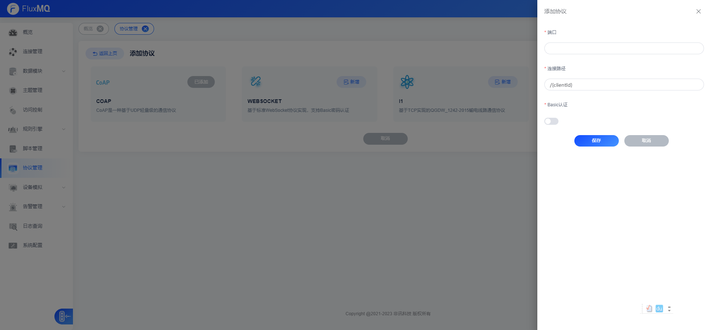
### 设置端口

### 设置连接HTTP的PATH

PATH必须包含{变量名称}  用于解析客户端ID，每个连接的客户端ID必须唯一。

## 建立连接

可以通过MQTT给下行Topic写入消息，FluxMQ会将数据在集群中路由，并且写给对应的Websocket连接
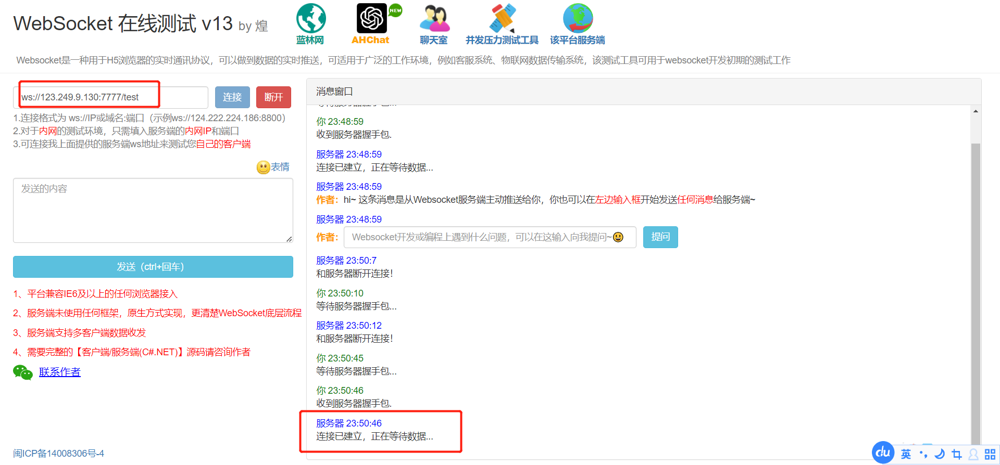

## 查看连接
> 连接的设备ID为Websocket连接的PATH占位符

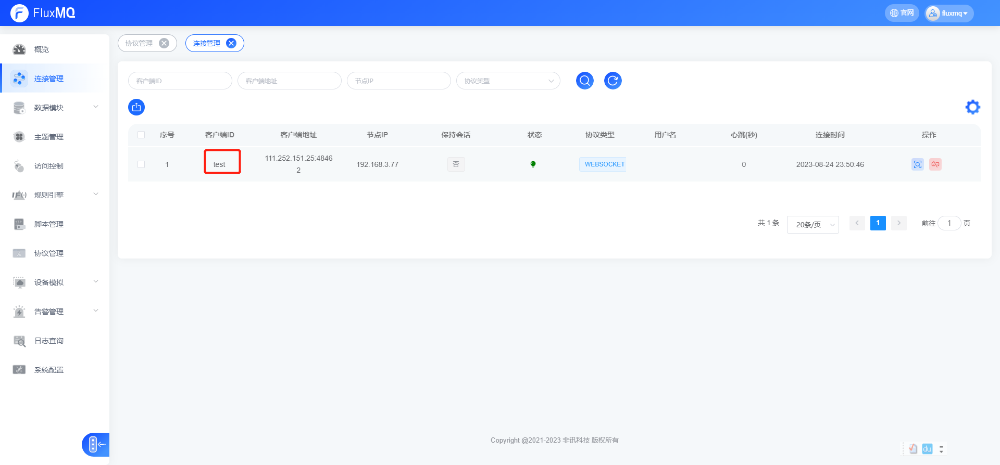

## 查看订阅
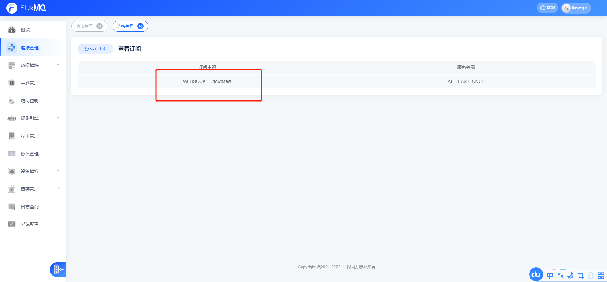
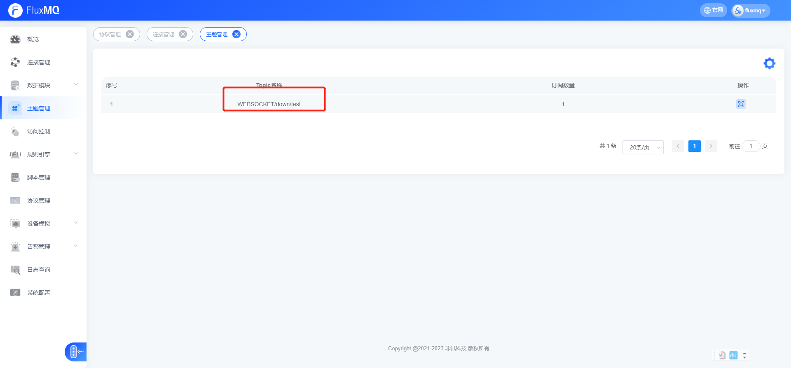

## MQTT.FX建立MQTT连接、订阅

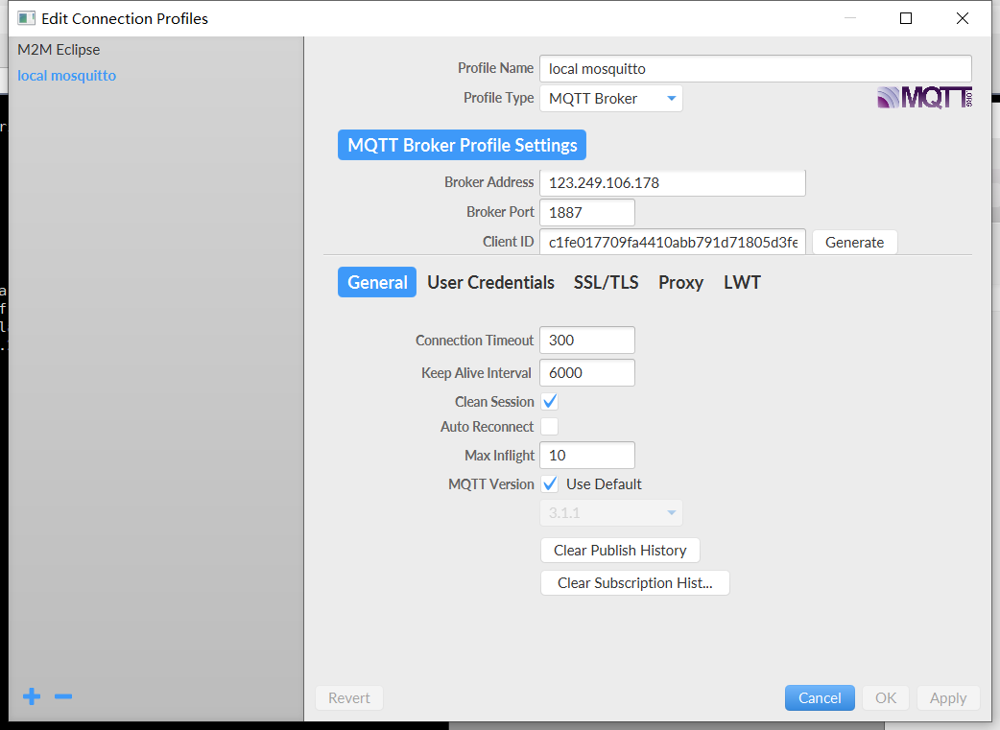

## 写WEBSOCKET

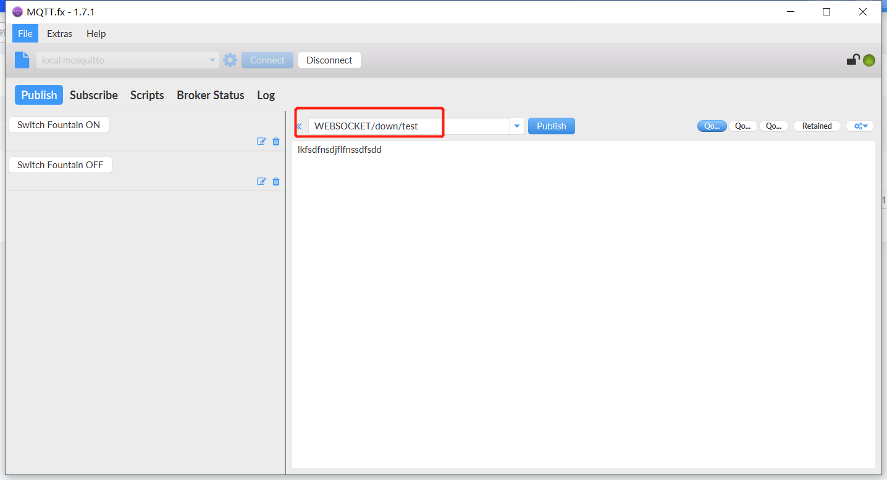
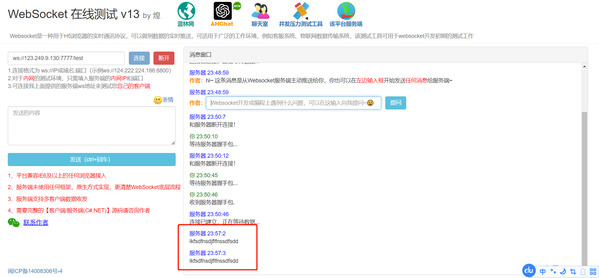

## 读WEBSOCKET
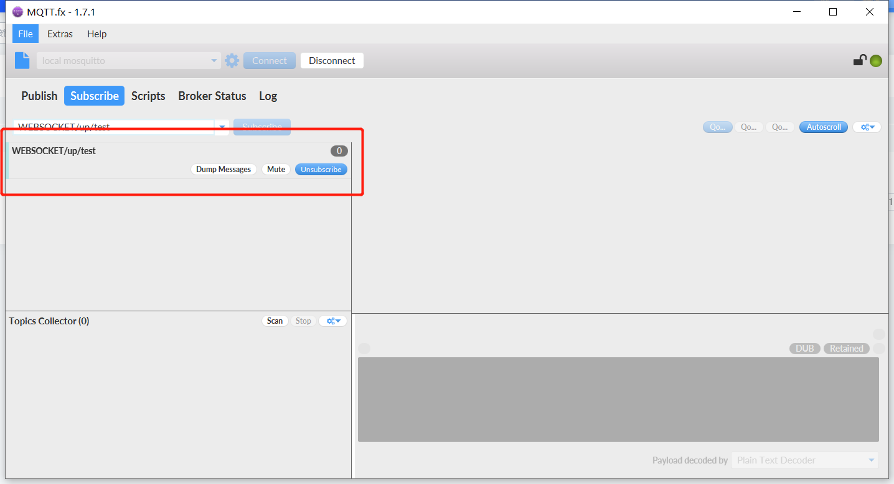
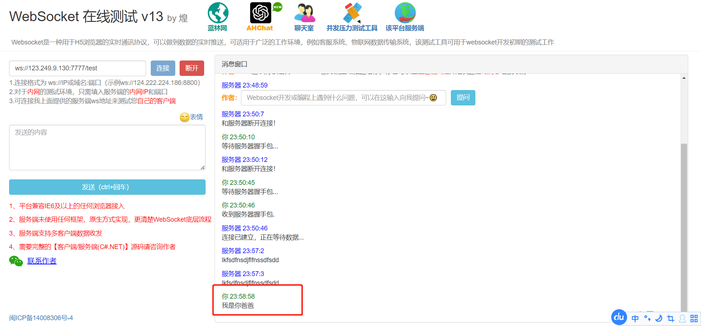
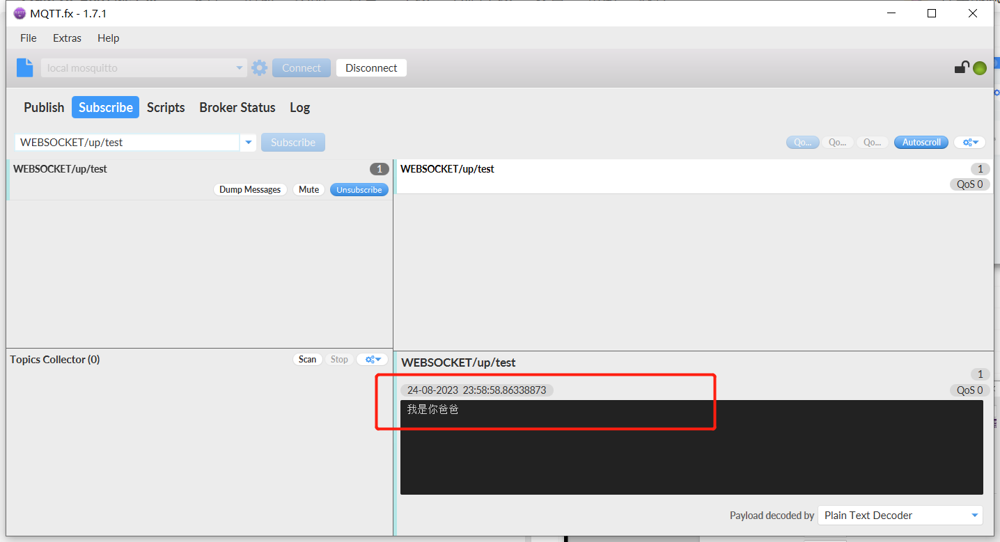

