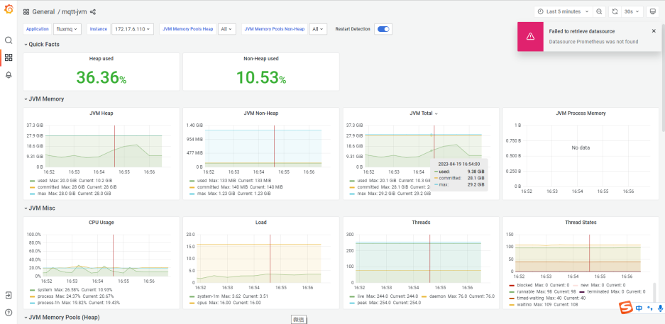
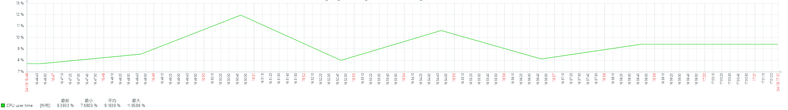
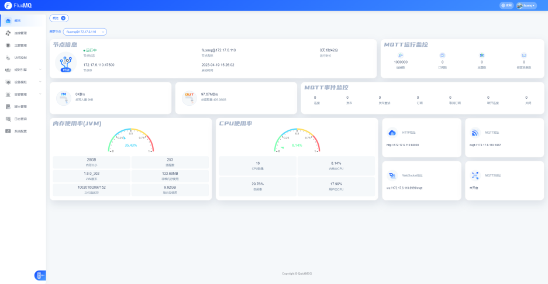
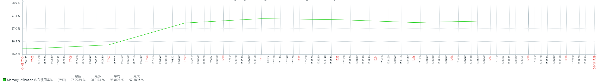

```shell
-Dname=$AppName  -Duser.timezone=Asia/Shanghai -Xmx28G -Xms28G -XX:MetaspaceSize=200M  -XX:+UseG1GC   -XX:MaxGCPauseMillis=200 -Xloggc:`$APP_HOME`/gc.log -XX:GCLogFileSize=10M -XX:NumberOfGCLogFiles=10 -XX:+UseGCLogFileRotation -XX:+PrintGCDateStamps -XX:+PrintGCTimeStamps -XX:+PrintGCDetails -XX:+DisableExplicitGC -verbose:gc
```
> 仅仅部署一台MQTT节点进行压测

## 桥接压测（KAFKA）
### 新建kafka数据源


### 新建规则转发


### 启用规则


### 10W TPS
| 连接 | 推送 | 报文大小 | cpu | 内存(最大使用) |
| --- | --- | --- | --- | --- |
| 50000 | 2/s | 160B | 22% | 8G |
| 50000 | 2/s | 1024B | 31% | 10G |

**160B压测截图：**


**1024B压测截图：**


### 15W TPS
| 连接 | 推送 | 报文大小 | cpu | 内存(最大使用) |
| --- | --- | --- | --- | --- |
| 50000 | 3/s | 160B | 31% | 13G |
| 50000 | 3/s | 1024B | 37% | 15G |

**160B压测截图：**


**1024B压测截图：**


### 20W TPS
| 连接 | 推送 | 报文大小 | cpu | 内存(最大使用) |
| --- | --- | --- | --- | --- |
| 50000 | 4/s | 160B | 35% | 14G |
| 50000 | 4/s | 1024B | 40% | 16G |

**160B压测截图：**


**1024B压测截图：**


## 连接&&并发测试

### 95W连接 && 5W TPS





### 97W连接 && 7W TPS




### 100W连接 && 10W TPS



