# 广播压测


```shell
-Dname=$AppName  -Duser.timezone=Asia/Shanghai -Xmx28G -Xms28G -XX:MetaspaceSize=200M  -XX:+UseG1GC   -XX:MaxGCPauseMillis=200 -Xloggc:`$APP_HOME`/gc.log -XX:GCLogFileSize=10M -XX:NumberOfGCLogFiles=10 -XX:+UseGCLogFileRotation -XX:+PrintGCDateStamps -XX:+PrintGCTimeStamps -XX:+PrintGCDetails -XX:+DisableExplicitGC -verbose:gc
```
> 仅仅部署一台MQTT节点进行压测

### 10W TPS
| 订阅 | 推送 | 报文大小 | cpu | 内存内存(最大使用) |
| --- | --- | --- | --- | --- |
| 50000 | 2/s | 160B | 20% | 1.7G |
| 50000 | 2/s | 1024B | 22% | 1.9G |

**160B压测截图：**


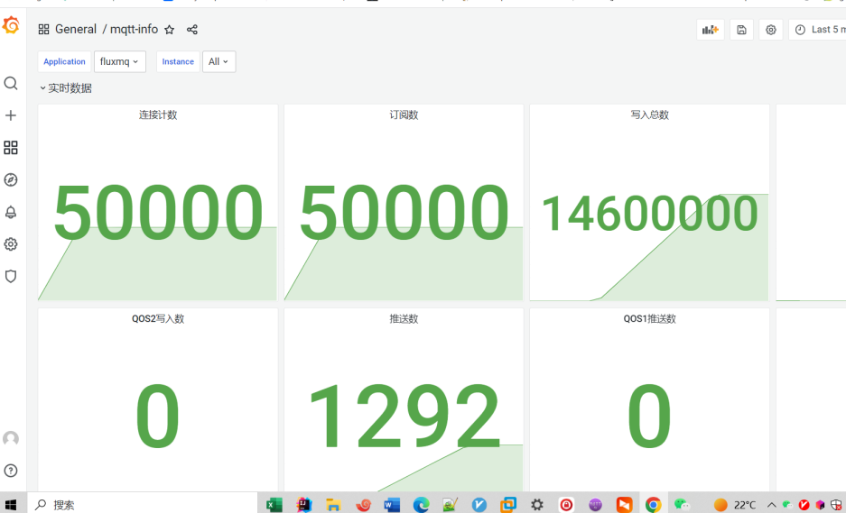

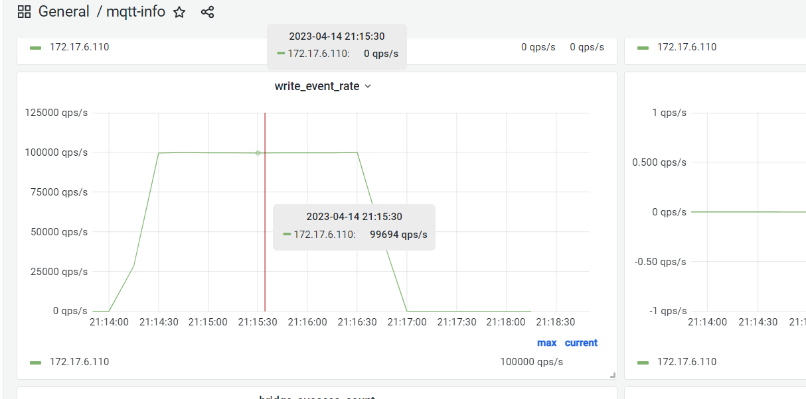

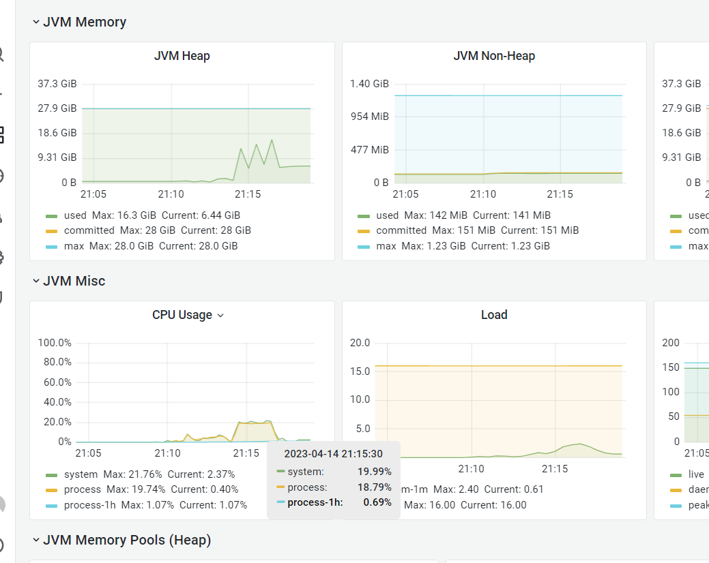


**1024B压测截图：**
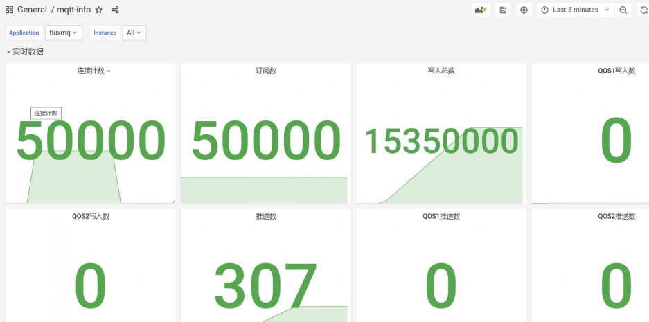
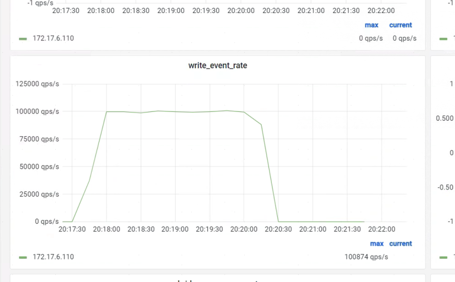
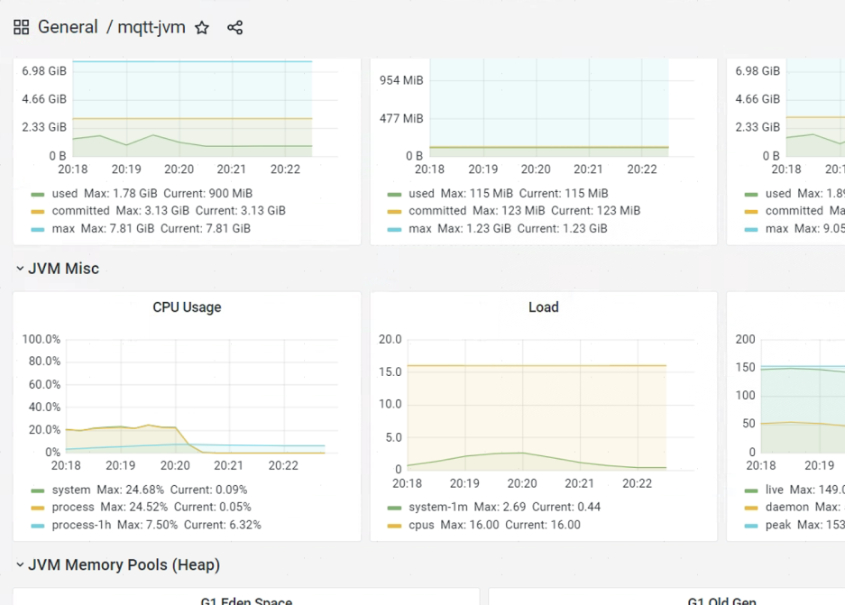


### 20W TPS

| 订阅 | 推送 | 报文大小 | cpu | 内存(最大使用) |
| --- | --- | --- | --- | --- |
| 50000 | 4/s | 160B | 23% | 1.7G |
| 50000 | 4/s | 1024B | 24% | 1.9G |

**160B压测截图：**

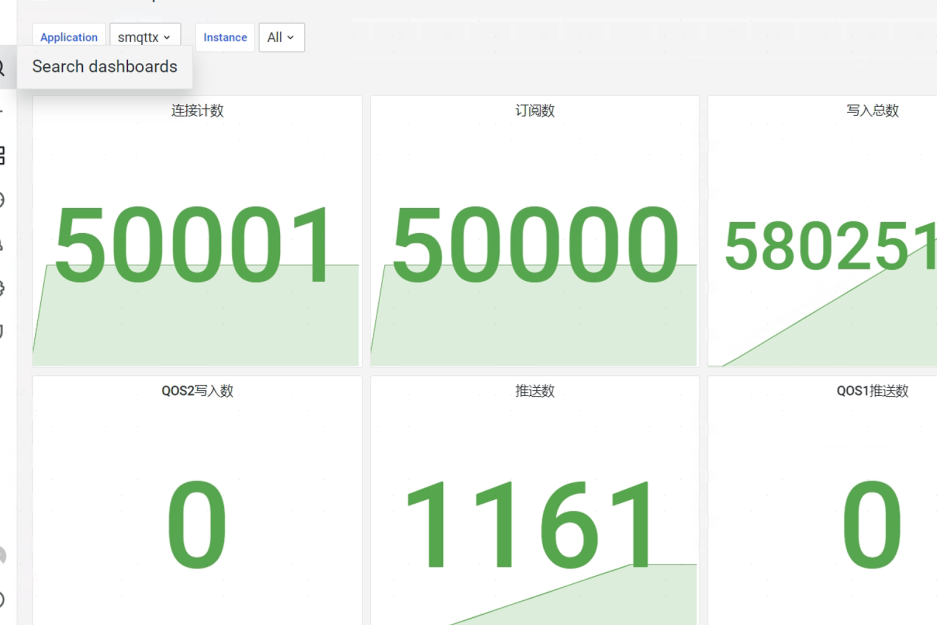
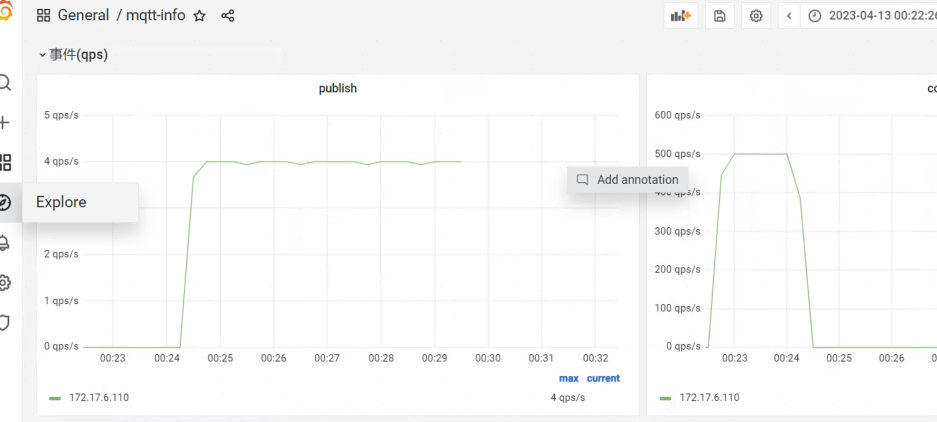
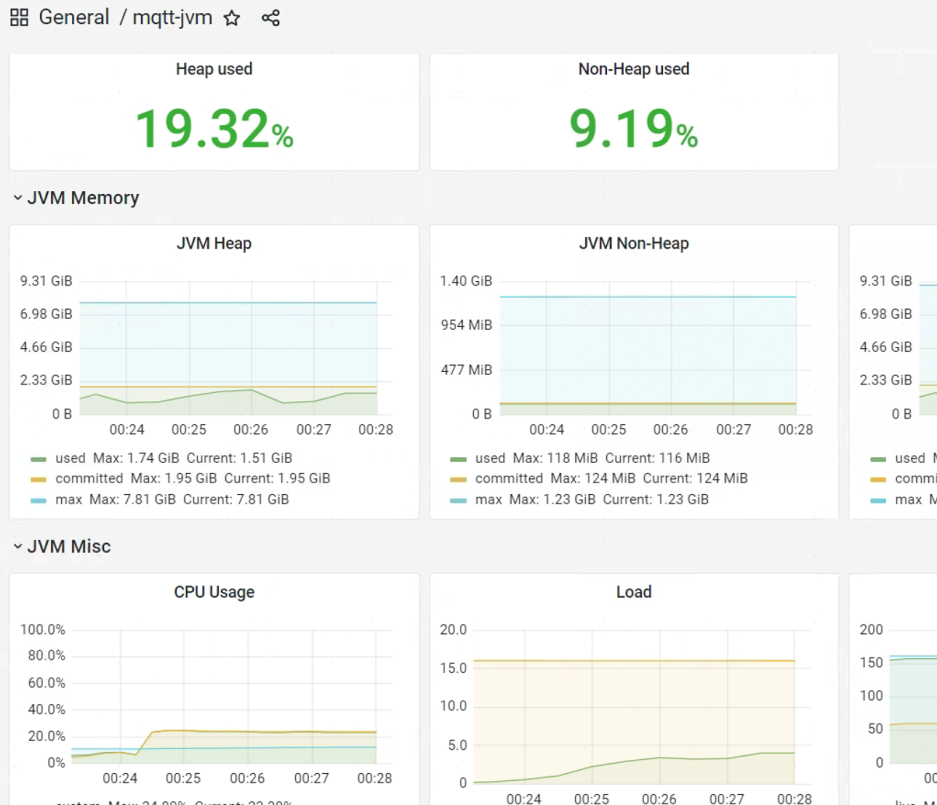
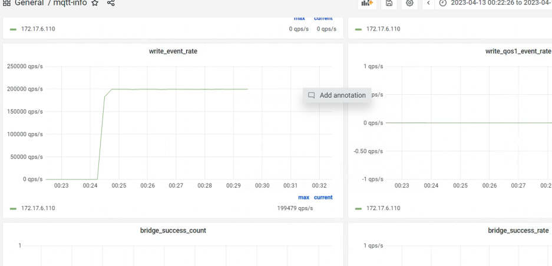


**1024B压测截图：**

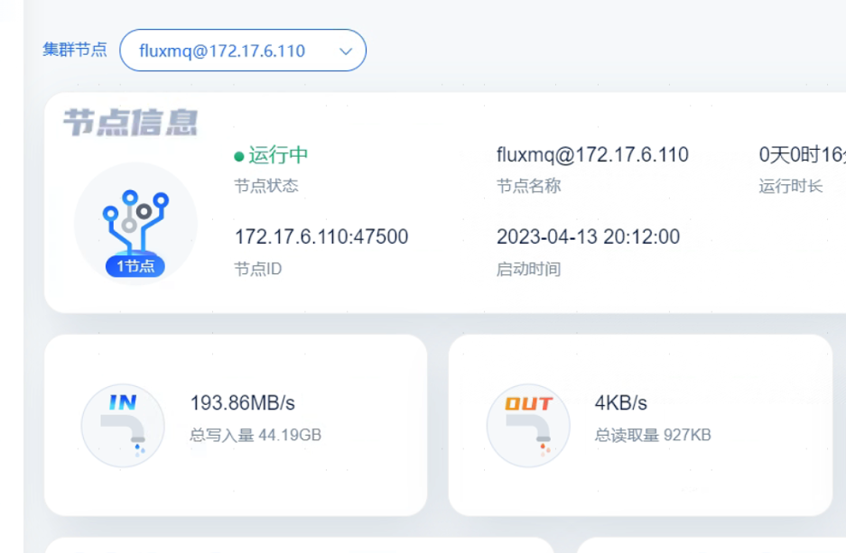
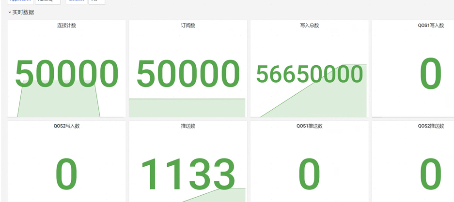
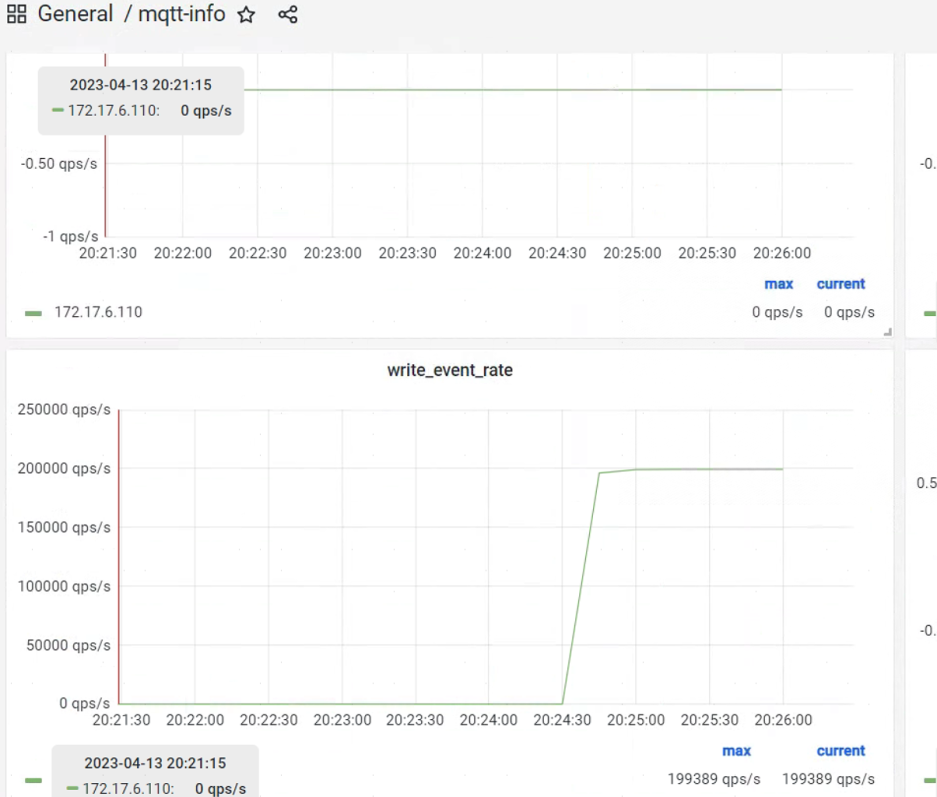
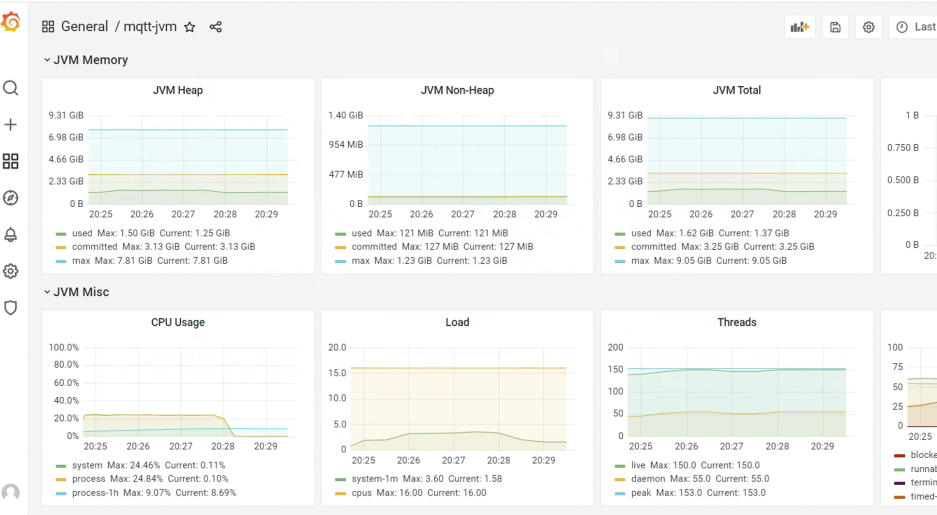


### 40W TPS
| 订阅 | 推送 | 报文大小 | cpu | 内存(最大使用) |
| --- | --- | --- | --- | --- |
| 100000 | 4/s | 160B | 48% | 15G |
| 100000 | 4/s | 1024B | GC过长 已到瓶颈 |  |

**160B压测截图：**


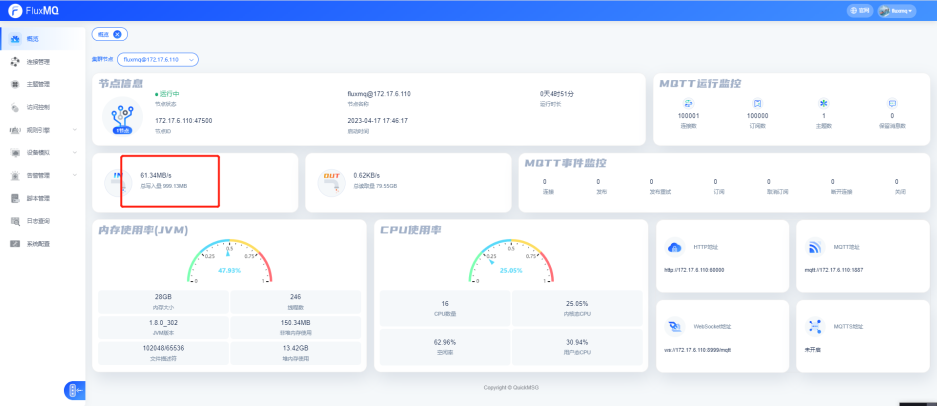
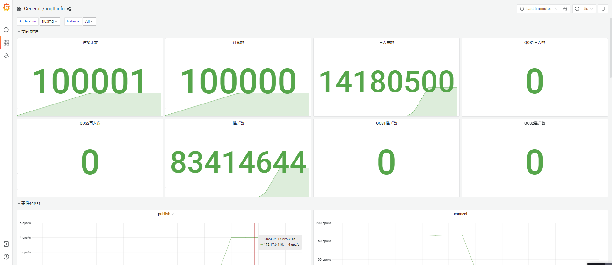
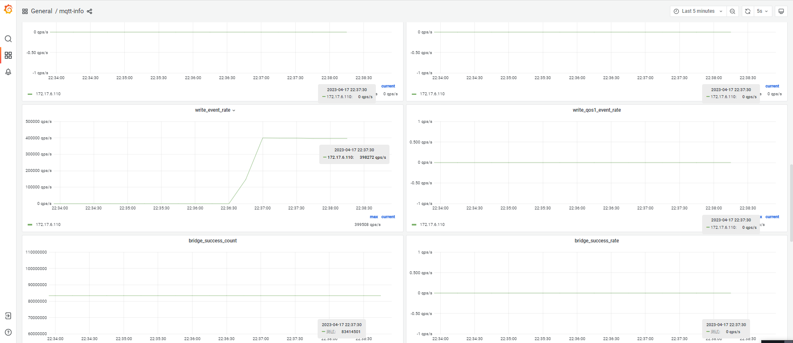
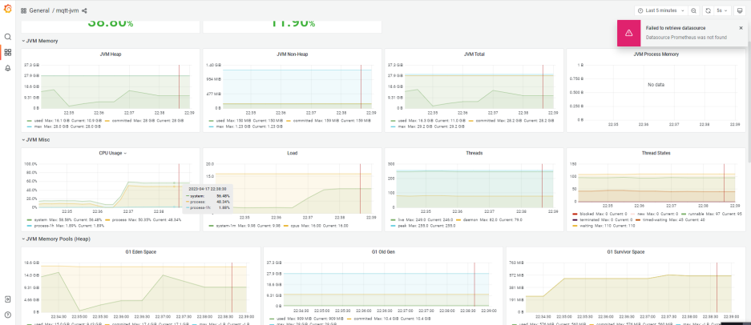


**1024B压测截图：**
> **如果追求极致性能 还是有很大优化空间**
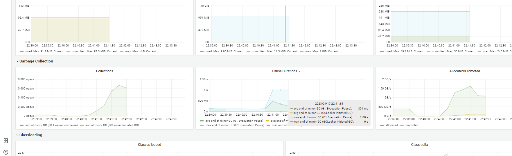
