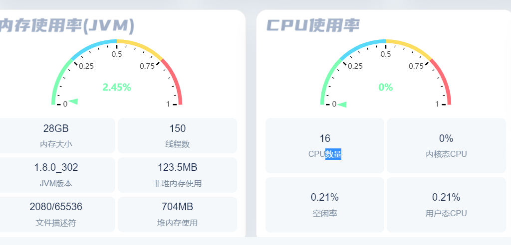
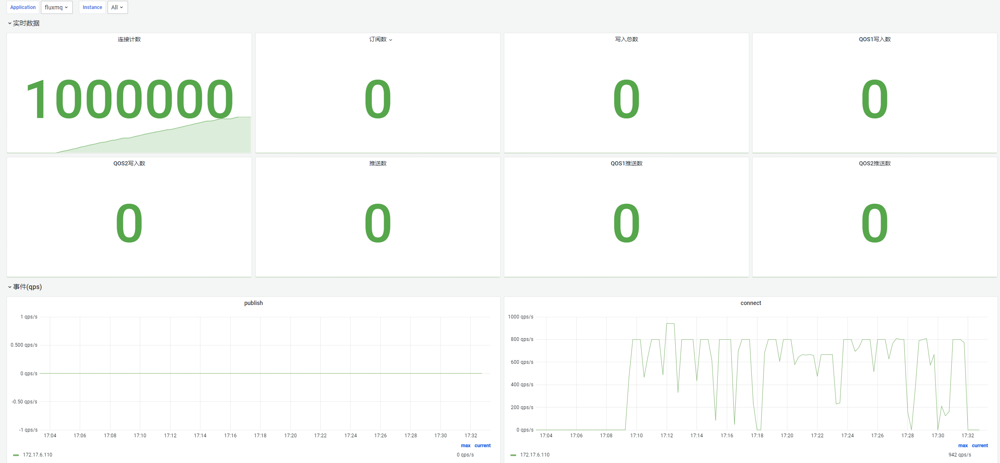
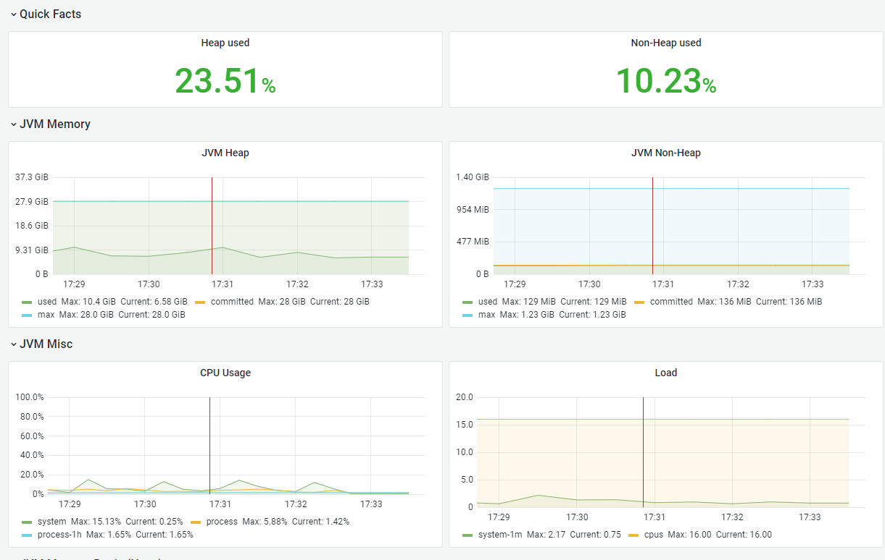
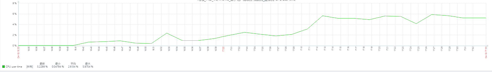

```shell
-Dname=$AppName  -Duser.timezone=Asia/Shanghai -Xmx28G -Xms28G -XX:MetaspaceSize=200M  -XX:+UseG1GC   -XX:MaxGCPauseMillis=200 -Xloggc:`$APP_HOME`/gc.log -XX:GCLogFileSize=10M -XX:NumberOfGCLogFiles=10 -XX:+UseGCLogFileRotation -XX:+PrintGCDateStamps -XX:+PrintGCTimeStamps -XX:+PrintGCDetails -XX:+DisableExplicitGC -verbose:gc
```
> 仅仅部署一台MQTT节点进行压测

## 连接数压测
| 连接数 | 推送 | 报文大小 | cpu | 内存内存(最大使用) |
| --- | --- | --- | --- | --- |
| 1000000 | 1000/s | --- | 25% | 9 G |





