# 连接&&并发测试


```shell
-Dname=$AppName  -Duser.timezone=Asia/Shanghai -Xmx28G -Xms28G -XX:MetaspaceSize=200M  -XX:+UseG1GC   -XX:MaxGCPauseMillis=200 -Xloggc:`$APP_HOME`/gc.log -XX:GCLogFileSize=10M -XX:NumberOfGCLogFiles=10 -XX:+UseGCLogFileRotation -XX:+PrintGCDateStamps -XX:+PrintGCTimeStamps -XX:+PrintGCDetails -XX:+DisableExplicitGC -verbose:gc
```
> 仅仅部署一台MQTT节点进行压测

### 95W连接 && 5W TPS
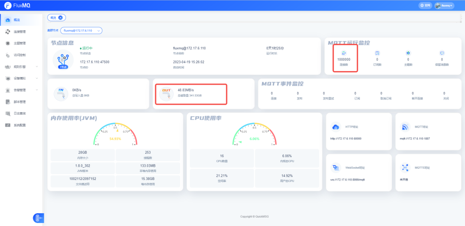
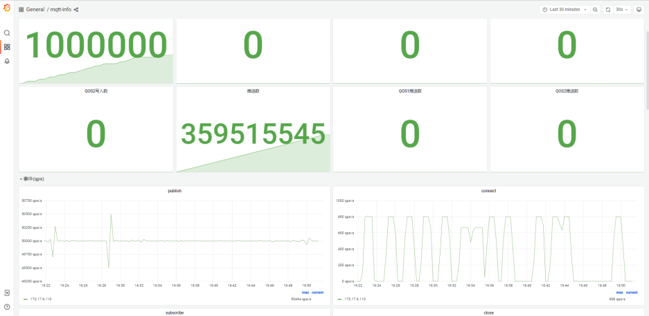
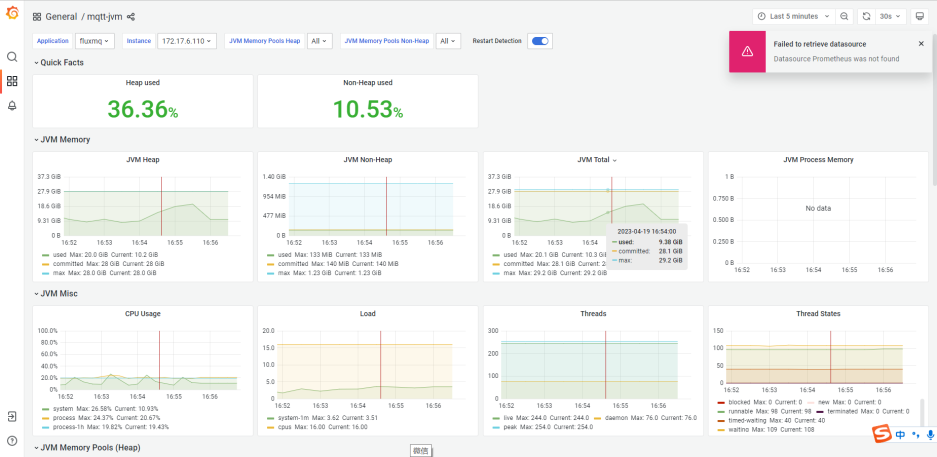
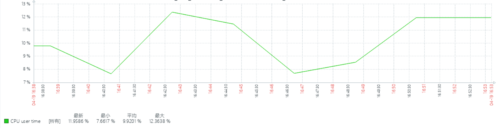
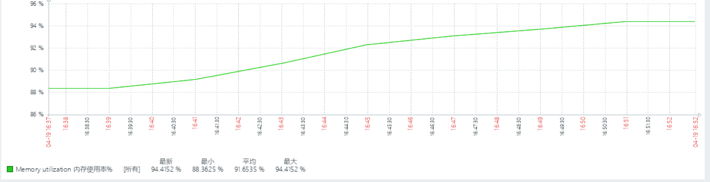

### 97W连接 && 7W TPS
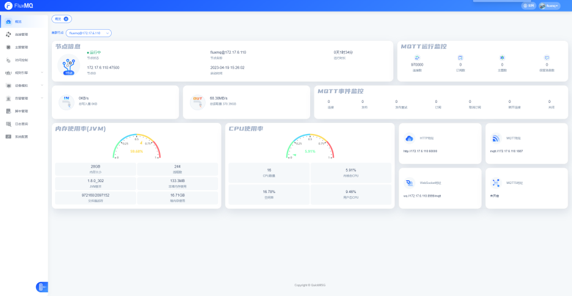
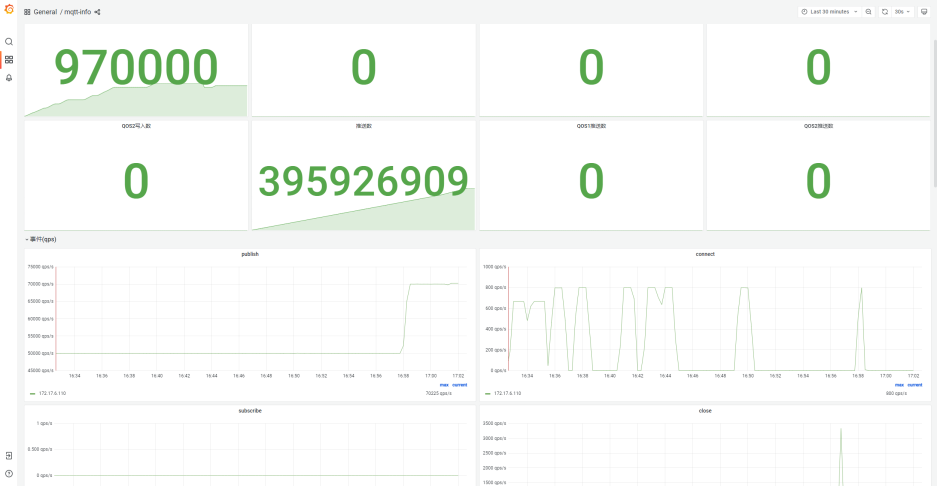
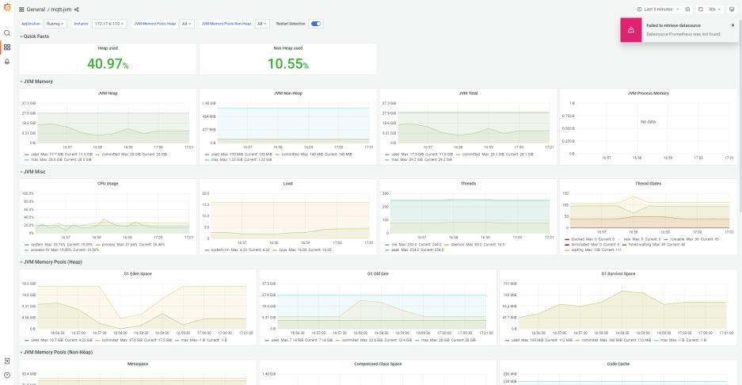
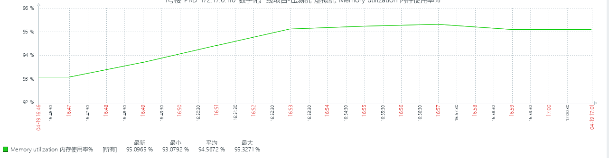
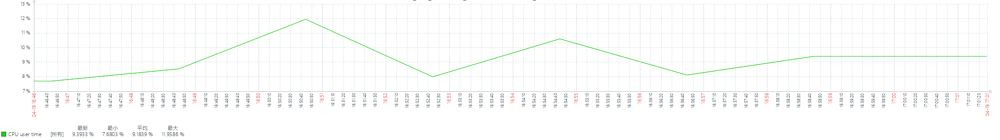

### 100W连接 && 10W TPS
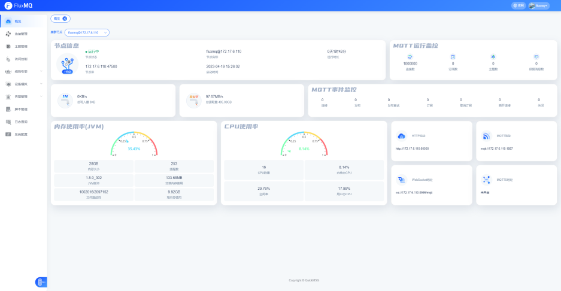
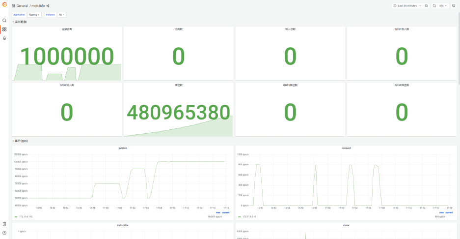
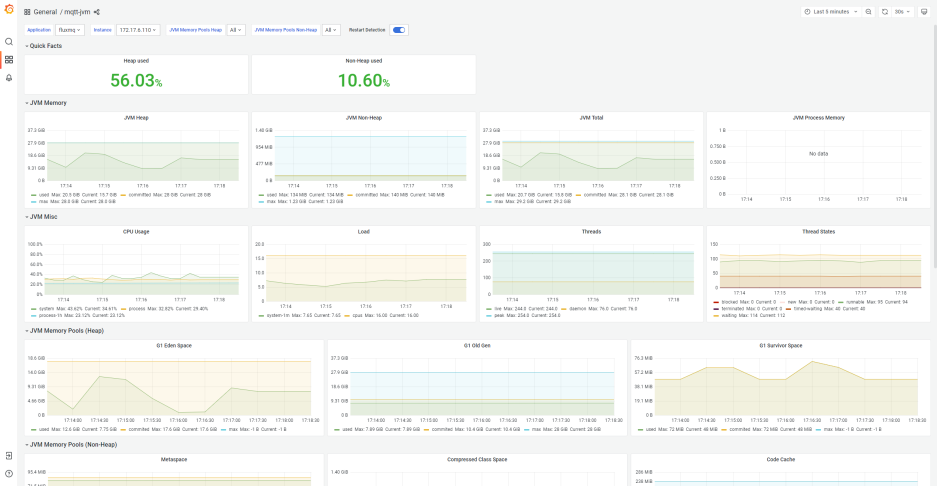
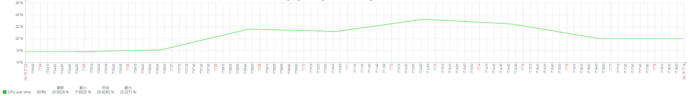
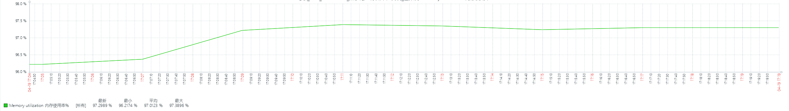