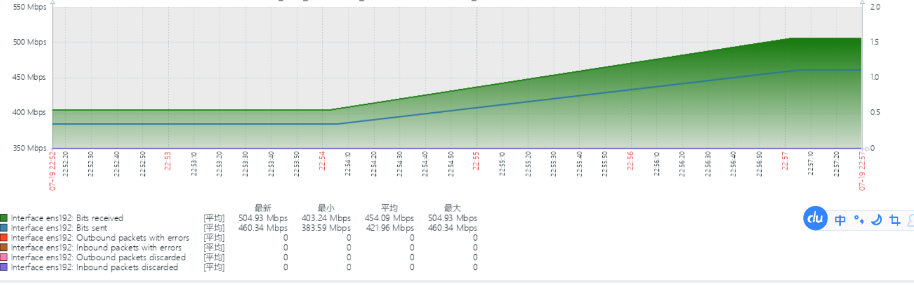

# 多Topic压测

### 压测准备 - 使用emqtt-bench压测工具
>https://github.com/emqx/emqtt-bench

发布脚本
```
./emqtt_bench pub -t %i  -h 172.17.6.75   -p 1887 -u smqtt -P smqtt -s 1024 -q 0 -c 1 -I 1000  -i 2 -L 1000000
```

订阅脚本
```订阅
./emqtt_bench sub -t %i  -h 172.17.6.75   -p 1887 -u smqtt -P smqtt -c 5000  -i 4 -q 0
```

### 压测指标
|           压测目标(CPU使用率)            | FluxMQ | BifrMQ | EMQX |  HiveMQ  | TBMQ |
|:---------------------------------:|:------:|:------:|:----:|:--------:|:----:|
|  multi_5K_5K_0_1_1024_100000000   |   3%   |   8%   | 16%  |    8%    | 暂不压测 |
|  multi_5W_5W_0_1_1024_100000000   |  20%   |  47%   | 50%  | 45%（波动大） | 暂不压测 |
|  multi_5W_5W_0_2_1024_100000000   |  35%   |  74%   | 80%  |   `崩溃`   | 暂不压测 |
|  multi_5W_5W_1_1_1024_100000000   |  30%   |  66%   | 81%  |   `崩溃`   | 暂不压测 |
|  multi_5W_5W_1_2_1024_100000000   |  `崩溃`  |  `崩溃`  | `崩溃` |   `崩溃`   | 暂不压测 |
|  multi_3W_3W_2_1_1024_100000000   |  31%   |  47%   | 80%  |   61%    | 暂不压测 |


### 压测明细
>连接数_订阅数_QOS_频率(每秒)_数据包大小_数据包总数

>multi_5K_5K_0_1_1024_100000000


> multi_5W_5W_0_1_1024_100000000


> multi_5W_5W_0_2_1024_100000000


> multi_5W_5W_1_1_1024_100000000




> multi_5W_5W_1_2_1024_100000000


> multi_3W_3W_2_1_1024_100000000


