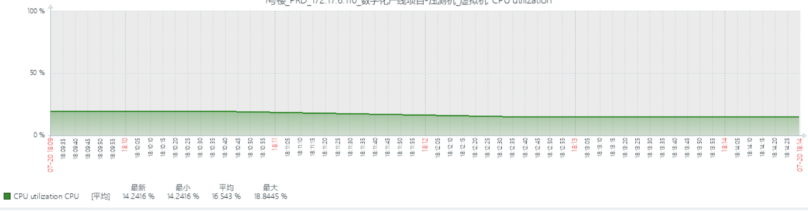
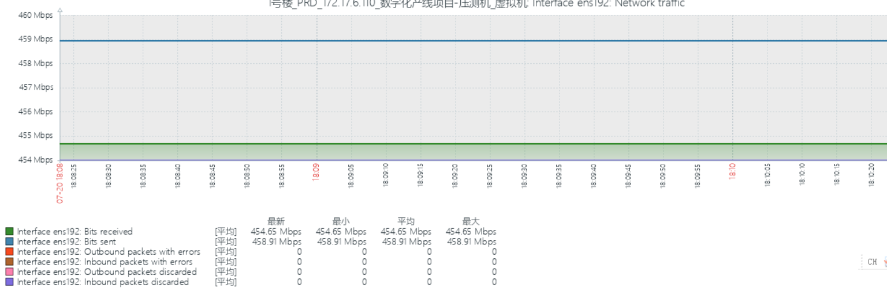
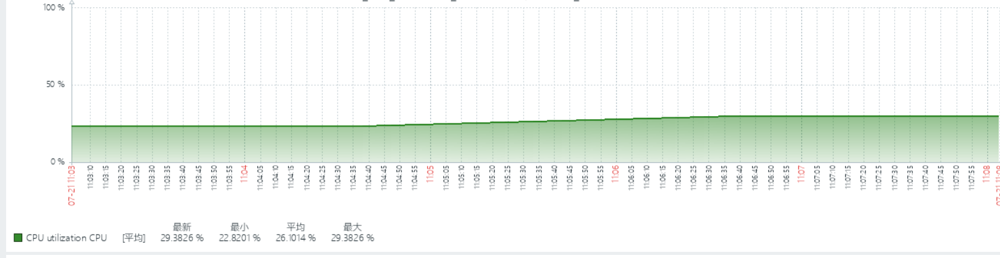
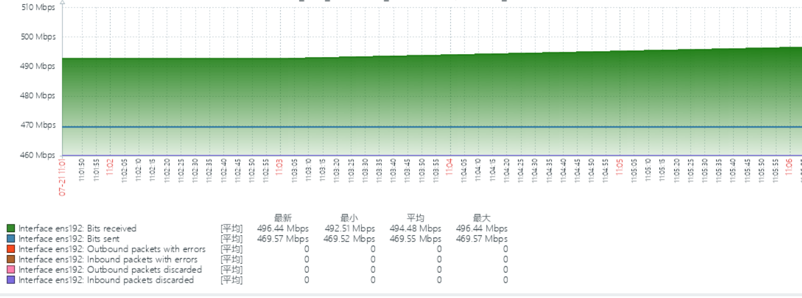
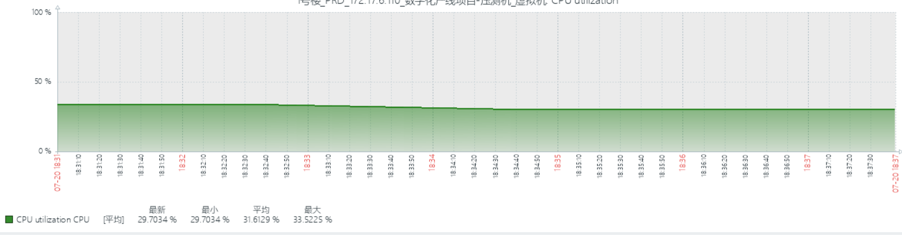
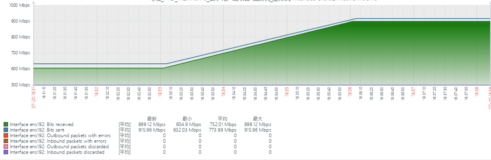
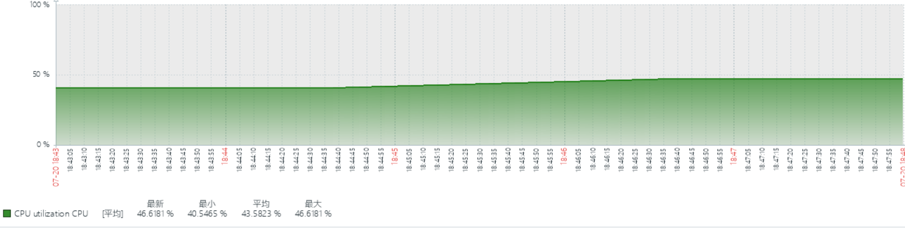
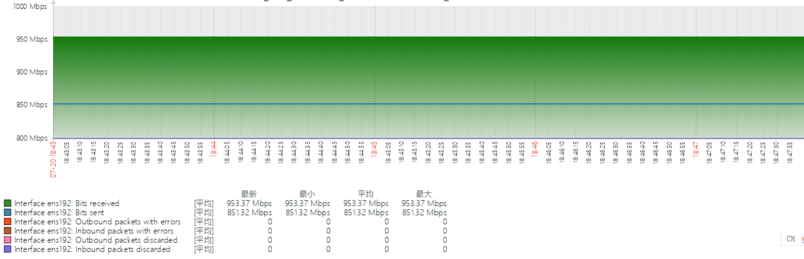

# 共享订阅压测

### 压测准备 - 使用emqtt-bench压测工具
>https://github.com/emqx/emqtt-bench

发布脚本
```
./emqtt_bench pub -t test  -h 172.17.6.75   -p 1887 -u smqtt -P smqtt -s 1024 -q 0 -c 1 -I 1000  -i 2 -L 1000000
```
订阅脚本
```
./emqtt_bench sub -t '$share/test'  -h 172.17.6.75   -p 1887 -u smqtt -P sm qtt -c 50000  -i 2 -q 0
```

### 压测指标
|          压测目标(CPU使用率)          | FluxMQ | BifrMQ | EMQX | HiveMQ |
|:------------------------------:|:------:|:------:|:----:|:------:|
| share_5W_50_0_1_1024_100000000 |  16%   |  34%   | 56%  |  `崩溃`  |
| share_5W_50_1_1_1024_100000000 |  26%   | `订阅限制` | 83%  |  `崩溃`  |
| share_5w_50_0_2_1024_100000000 |  31%   |  50%   | 81%  |  `崩溃`  |
| share_5w_50_1_2_1024_100000000 |  43%   | `订阅限制` | `崩溃` |  `崩溃`  |


### 压测明细
>连接数_订阅数_QOS_频率(每秒)_数据包大小_数据包总数

> share_5W_50_0_1_1024_100000000




> share_5W_50_1_1_1024_100000000




> share_5w_50_0_2_1024_100000000




> share_5w_50_1_2_1024_100000000



