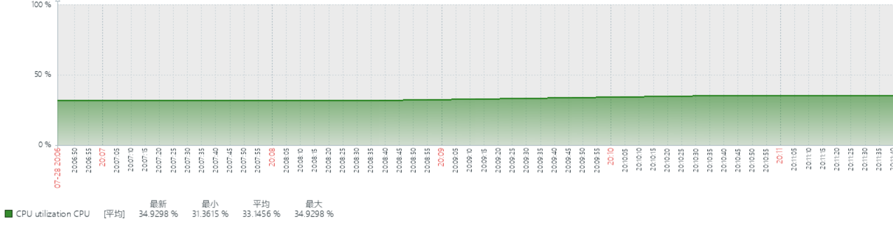
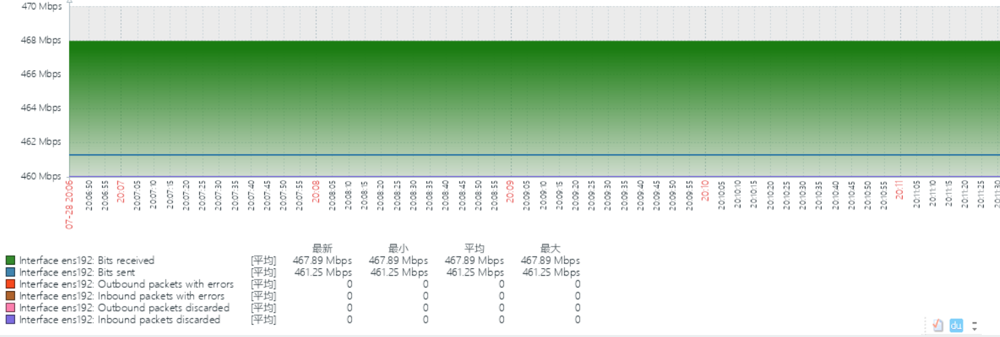
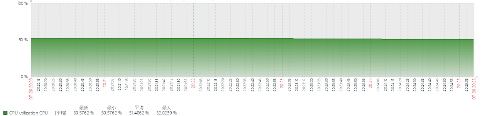
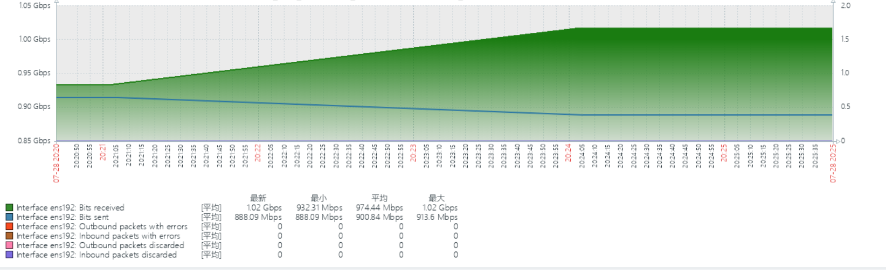
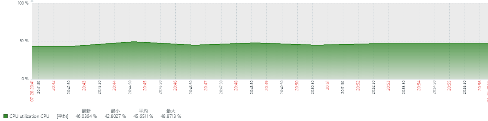
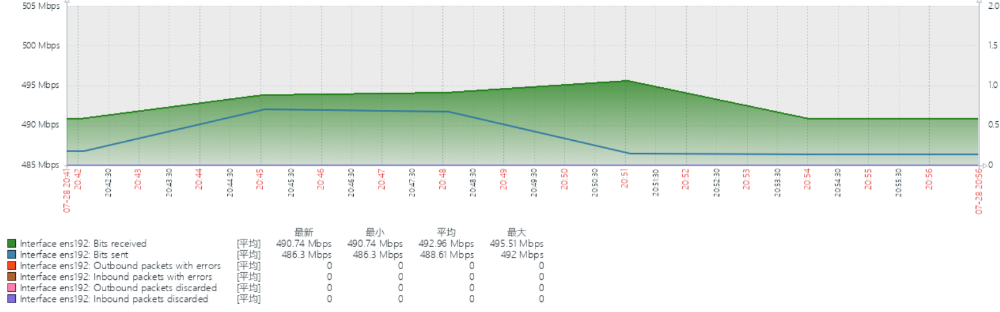

## 通配符压测

### 压测准备 - 使用emqtt-bench压测工具
>https://github.com/emqx/emqtt-bench

### 压测指标
>连接数_订阅数_QOS_频率(每秒)_数据包大小_数据包总数

```发布
./emqtt_bench pub -t %i/test  -h 172.17.6.75   -p 1887 -u smqtt -P smqtt -s 1024 -q 0 -c 1 -I 1000  -i 2 -L 1000000
```

```订阅
./emqtt_bench sub -t '%i/#'  -h 172.17.6.75   -p 1887 -u smqtt -P smqtt -c 50000  -i 2 -q 0
```

### 压测明细
> wildcard_5w_5w_0_1_1024_100000000




> wildcard_5w_5w_0_2_1024_100000000




> wildcard_5w_5w_1_1_1024_100000000



