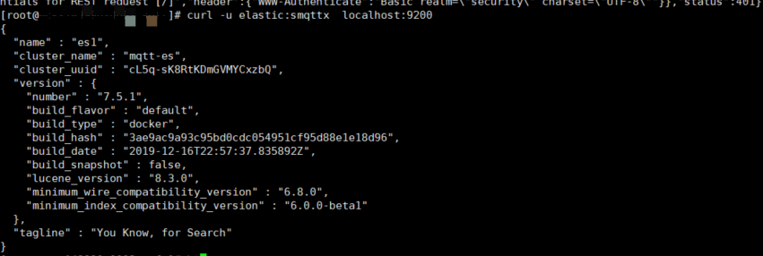
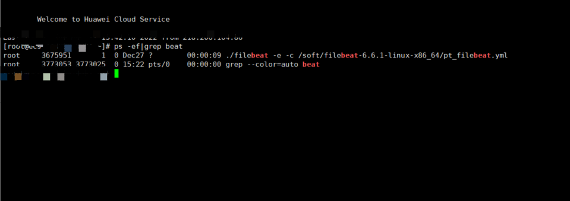

# 日志系统部署
## 1. 安装ES
```shell
https://fluxmq.obs.cn-east-3.myhuaweicloud.com/install_elk.zip
```

上传安装包install_elk.zip 到服务器上
```shell
unzip install_elk.zip
#进入解压目录
cd ~/install_monitor
#脚本赋权
chmod +x ./*
#部署(elasticsearch、logstash)
sh install_elk.sh  elk
#部署日志采集
#ip1:部署服务器内网ip  ip2/3/4:fluxmq节点内网ip）----ip1 需要到ip2、ip3、ip4免密
#log_path 日志打印目录，比如/soft,注意打印的日志文件须满足：*info.log、*error.log、*warn.log
sh install_elk.sh filebeat ip1  ip2,ip3,ip4  log_path
```
## 2. ES验证

**curl -u elastic:smqttx  localhost:9200**
返回结果如下：
```shell
{
  "name" : "es1",
  "cluster_name" : "mqtt-es",
  "cluster_uuid" : "cL5q-sK8RtKDmGVMYCxzbQ",
  "version" : {
    "number" : "7.5.1",
    "build_flavor" : "default",
    "build_type" : "docker",
    "build_hash" : "3ae9ac9a93c95bd0cdc054951cf95d88e1e18d96",
    "build_date" : "2019-12-16T22:57:37.835892Z",
    "build_snapshot" : false,
    "lucene_version" : "8.3.0",
    "minimum_wire_compatibility_version" : "6.8.0",
    "minimum_index_compatibility_version" : "6.0.0-beta1"
  },
  "tagline" : "You Know, for Search"
}
```

## 3. filebeat验证
日志采集服务器上执行：ps -ef|grep beat


