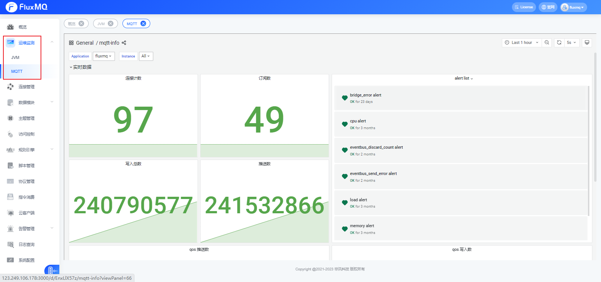

# Metrics

## 介绍
FluxMQ为用户提供了丰富的指标来帮助用户与运维人员了解当前服务状态，监测和排除系统的性能问题。

可通过 FluxMQ Dashboard 或 HTTP API 和系统主题来获取 FluxMQ 指标信息。

用户可以在 FluxMQ Dashboard 的 运维监测 页面看到这些数据。

## 与监控系统集成
运维监测 使用第三方监控系统对 FluxMQ 进行监控：

- 将 FluxMQ 的监控数据与其他系统的监控数据进行整合，形成一个完整的监控系统，如监控JVM的相关信息；
- 使用更加丰富的监控图表，更直观地展示监控数据，如使用 Grafana 的仪表盘；
- 能够提供更加丰富的告警方式，更及时地发现问题，如使用 Prometheus 的 Alertmanager。

## 指标明细
**FluxMQ 目前提供的Metrics大致划分了 统计、事件、路由、协议、桥接 五个维度**

### 统计 (statistics)

| **Metrics**            | **描述**  | **Tag** |
|------------------------|---------|---------|
| mqtt.connect.count     | 当前连接数   |
| mqtt.subscribe.count   | 当前订阅数   |

### 事件 (event)

| **Metrics**                  | **描述** | **Tag** |
|------------------------------|--------|---------|
| mqtt.publish.event.count     | 消息发布数  |服务级别：qos |
| mqtt.write.event.count       | 消息写入数  |服务级别：qos |
| mqtt.write.retry.count       | 消息重发数  |
| mqtt.write.error.count       | 消息写入失败数 |
| mqtt.connect.event.count     | 连接事件数  |
| mqtt.subscribe.event.count   | 订阅事件数  |
| mqtt.unsubscribe.event.count | 取消订阅事件数 |
| mqtt.disconnect.event.count  | 断开连接事件数 |
| mqtt.close.event.count       | 关闭连接事件数 |

### 路由 (event_bus)

| **Metrics**                  | **描述**  | **Tag** |
|------------------------------|---------|---------|
| eventbus.send.success.count  | 消息路由成功数 | 五       |
| eventbus.send.error.count    | 消息路由异常数 |
| eventbus.receive.count       | 路由消息接收数 |
| eventbus.discard.count       | 路由消息丢失数 |

### 桥接 (bridge)

| **Metrics**                       | **描述**    | **Tag**       |
|-----------------------------------|-----------|---------------|
| mqtt.bridge.success.event.count   | 消息桥接成功数   | 规则名称：ruleName |
| mqtt.bridge.error.event.count     | 消息桥接异常数   | 规则名称：ruleName             |

### 指令消费
| **Metrics Key**                 | **描述**    | **Tag**                |
|---------------------------------|-----------|------------------------|
| command.receiver.event.count    | 指令消费数     | 指令类型：command |