# 二、压力测试说明
> EMQX 是基于高并发的 Erlang/OTP 语言平台开发，支持百万级连接、分布式集群架构、发布订阅模式的 MQTT 消息服务器。
FluxMQ是基于JAVA（Netty），底层采用Reactor3反应堆模型，具备低延迟，高吞吐量，高性能的分布式集群MQTT消息服务器。
两者在开发语言上有所区别，FluxMQ采用JAVA更方便物联网平台的高度集成和快速改造。

MQTT-Broker作为物联网平台的核心；在实际使用中的性能通常被用户作为判断一个服务器好坏的标准，因此本次评测重点关注其性能测试结果。
## 测试环境
| 服务 | 版本 | 操作系统 | CPU | 内存 | 数量 |
| --- | --- | --- | --- | --- | --- |
| EMQX | 4.3.3 | Centos 7.6 | 16C | 32G | 1 |
| 压测机 | -- | Centos 7.6 | 4C | 8G | 20+ |
| FluxMQ | 1.0.0 | Centos 7.6 | 16C | 32G | 1 |
| Kafka集群 | -- | Centos 7.6 | 48C | 128G | 3 |

测试数据：payload 160B，1024B；
## 测试架构说明
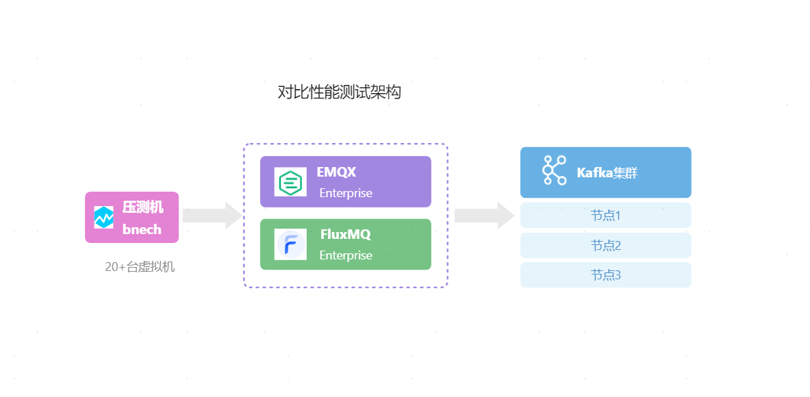

## 测试目标
验证 FluxMQ和EMQX 单机模式下；是否能够支撑100 万直连设备并发连接，并通过规则引擎桥接方式每秒转发至 Kafka 集群性能指标；

1. 单机纯连接100W设备
2. 单机并发吞吐能够最大稳定支撑量（TPS）
3. 单机连接100W设备时，能够支撑多少并发吞吐（TPS）
# 三、测试结果对比

测试结果：**FluxMQ在单机高并发高吞吐的性能和稳定性方面明显高于EMQX**；两者在纯连接方面性能相当。FluxMQ高并发场景因为JAVA原因对物理内存消耗较大，EMQX在高并发场景因为Erlang原因对物理内存消耗相对较小，但CPU消耗非常大。
## 纯连接100W
| 服务 | 运行情况 | CPU | 物理内存 | 备注说明 |
| --- | --- | --- | --- | --- |
| EMQX | 100W正常 | 12% | 40% |  |
| FluxMQ | 100W正常 | 5.5% | 63%； | JVM内存6.58G |

## 高并发吞吐
测试单条数据payload：1024B

| 服务 | 5WTPS/5W连接 | 10WTPS/10W连接 | 15WTPS/15W连接 | 20WTPS/20W连接 |
| --- | --- | --- | --- | --- |
| EMQX | 正常 | 正常 | 崩溃 | 崩溃 |
| FluxMQ | 正常 | 正常 | 正常 | 正常 |

10WTPS下性能对比

| 服务 | 运行情况 | CPU | 物理内存 | 备注说明 |
| --- | --- | --- | --- | --- |
| EMQX | 10WTPS正常 | 12% | 40% |  |
| FluxMQ | 10WTPS正常 | 10% | 64%； | JVM内存17.6G |

## 高并发连接下高吞吐
测试单条数据payload：1024B；

| 服务 | 5WTPS/95W连接 | 9WTPS/99W连接 | 10WTPS/100W连接 |
| --- | --- | --- | --- |
| EMQX | 正常 | 正常 | 崩溃 |
| FluxMQ | 正常 | 正常 | 正常 |

9WTPS/99万连接下性能对比

| 服务 | 运行情况 | CPU | 物理内存 | 备注说明 |
| --- | --- | --- | --- | --- |
| EMQX | 10WTPS正常 | 84% | 80% |  |
| FluxMQ | 10WTPS正常 | 12% | 95%； | JVM内存18.3G |

# 四、测试详细说明
## 纯连接100W
### EMQX测试过程截图
Dashboard监控
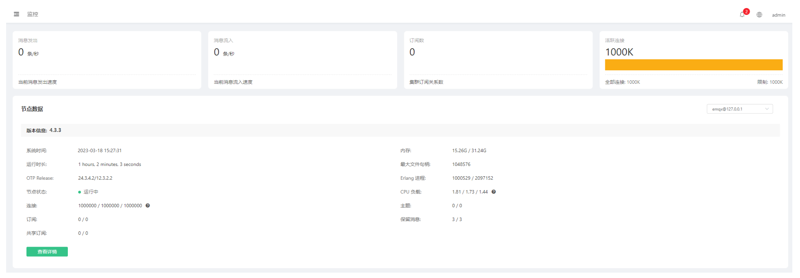
CPU使用监控
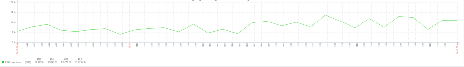
物理内存使用监控
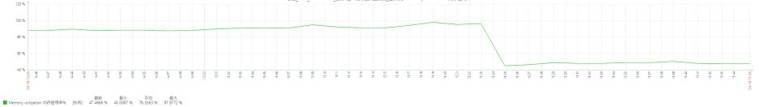

### FluxMQ测试过程截图
Dashbaord监控
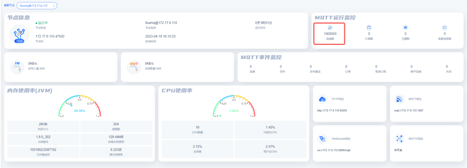

CPU使用监控
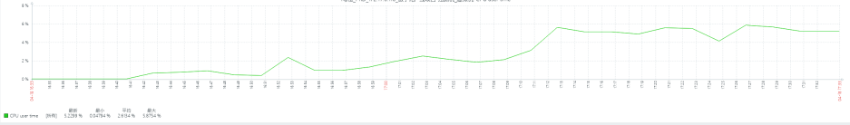

物理内存使用监控
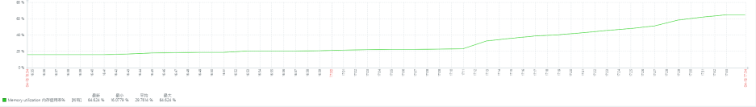

JVM内存使用监控
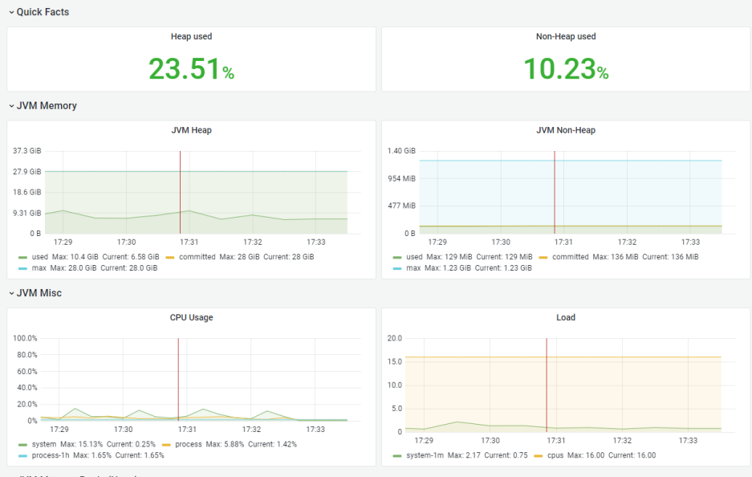

## 10WTPS/10W连接--1024B
### EMQX测试过程截图

Dashboard监控
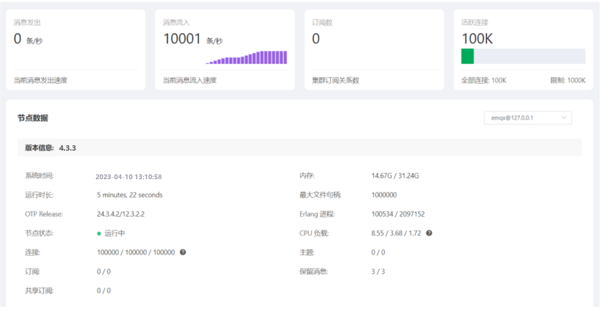
CPU使用监控
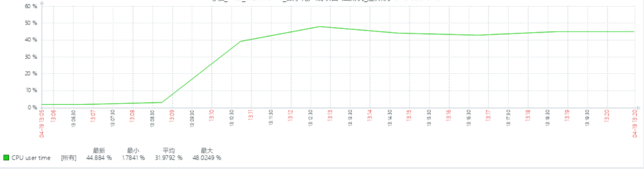
物理内存使用监控
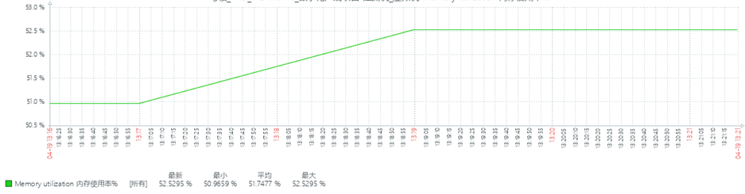

### FluxMQ测试过程截图
Dashboard监控
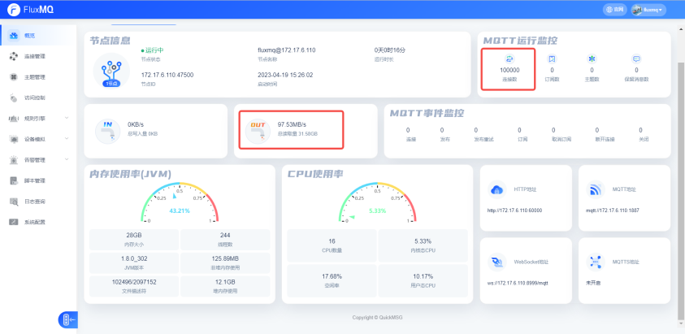
CPU使用监控
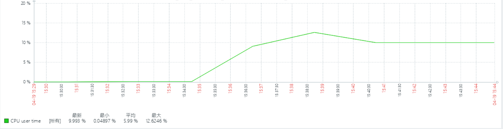
物理内存使用监控
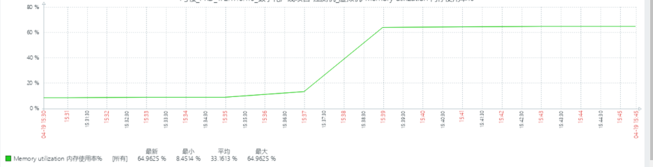
JVM内存
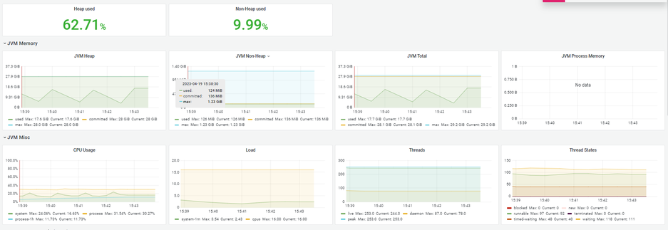

## 20WTPS/20W连接 --1024B
### EMQX测试过程截图
系统崩溃，略
### FluxMQ测试过程截图

Dashboard监控
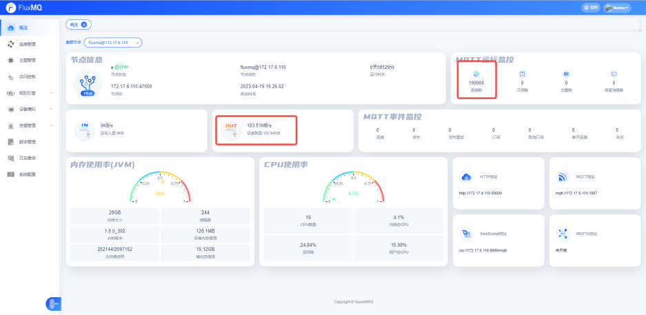

CPU使用监控
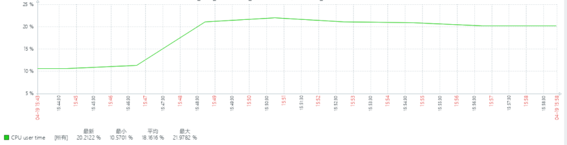
物理内存使用监控
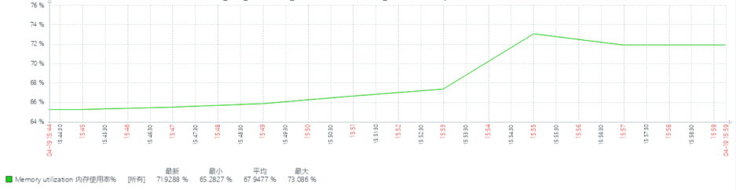
JVM内存
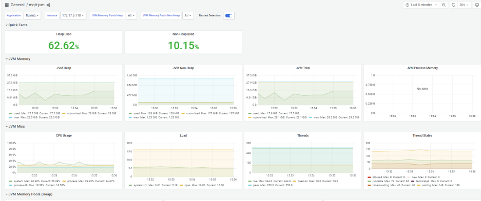

## 9WTPS/99W连接 --1024B
### EMQX测试过程截图
Dashboard监控
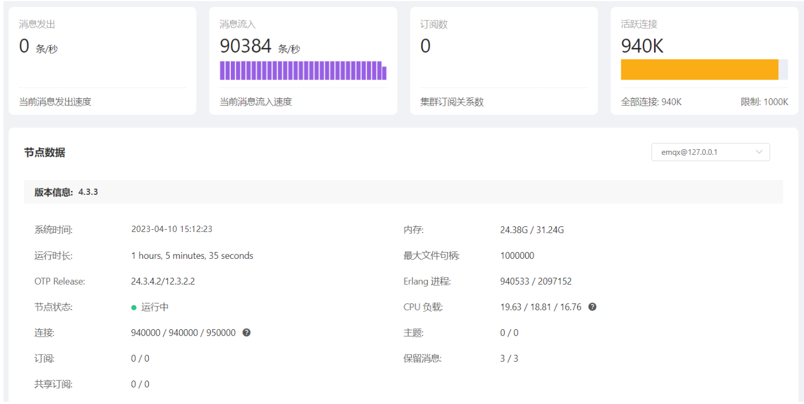
CPU使用监控
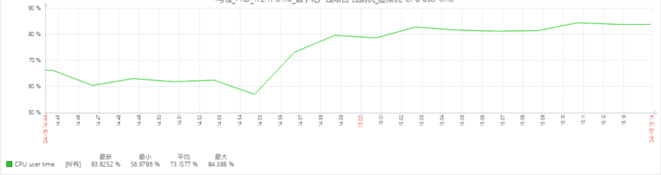
物理内存使用监控
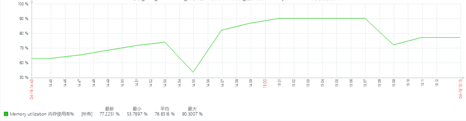

### FluxMQ测试过程截图
Dashboard监控

CPU使用监控
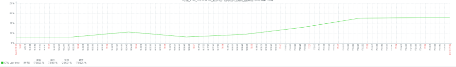
物理内存使用监控
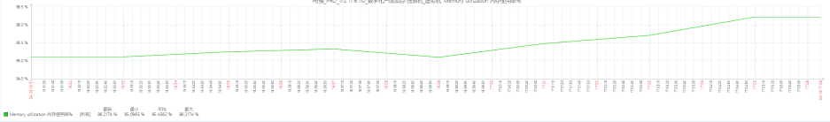
JVM内存监控
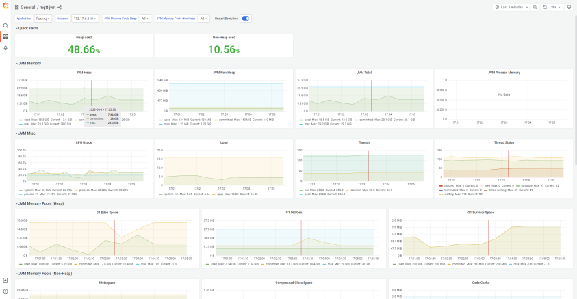

## 10WTPS/100W连接 --1024B
### EMQX测试过程截图
系统崩溃，略
### FluxMQ测试过程截图
Dashboard监控
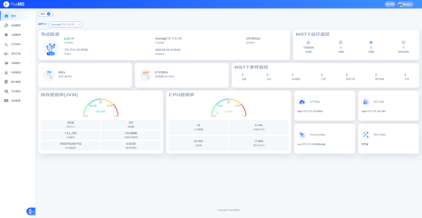
CPU使用监控
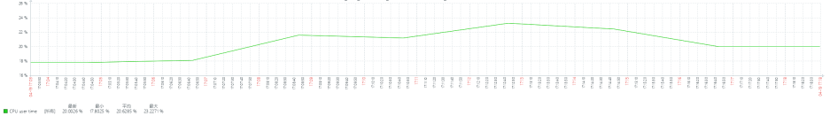
物理内存使用监控
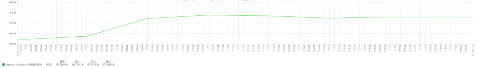
JVM内存监控
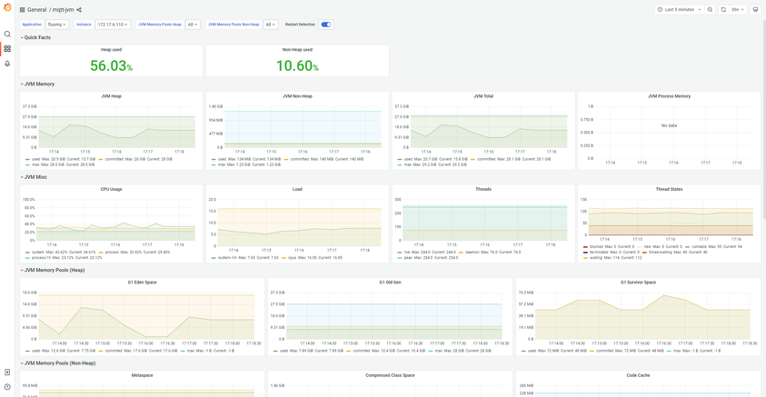
